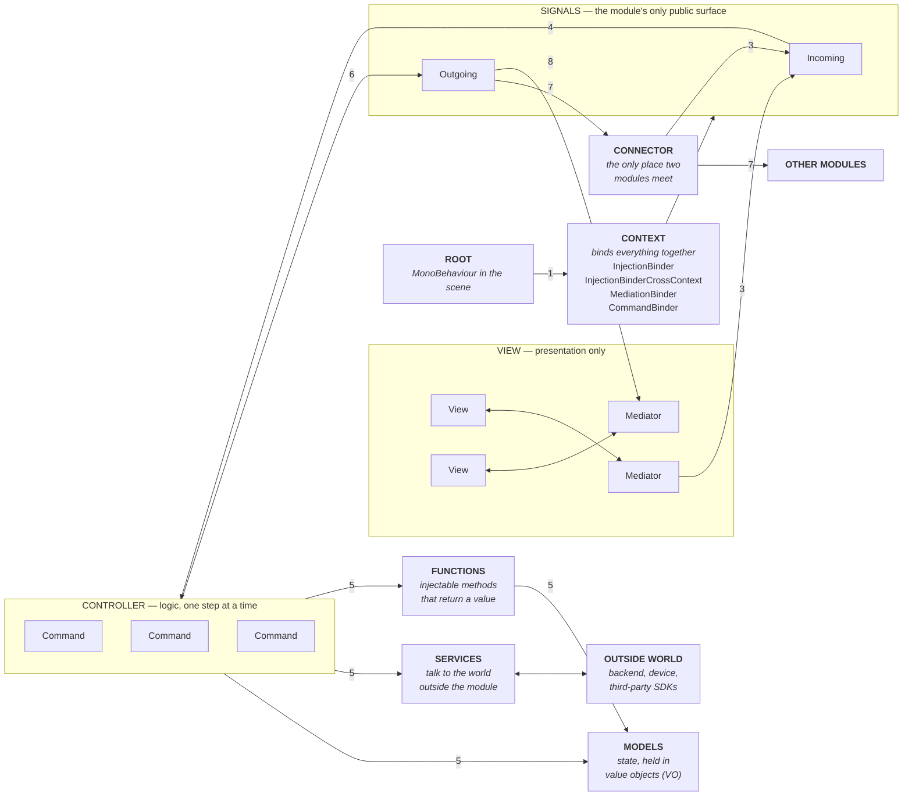
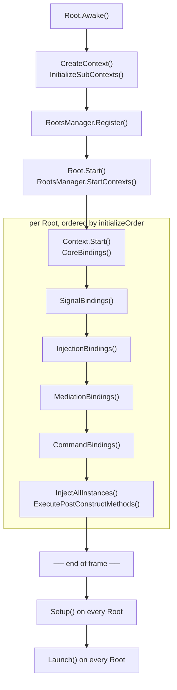

# FlowIoC

[](https://openupm.com/packages/com.flowarc.flowioc.core/)

**A signal-driven IoC container and modular MVC framework for the Unity Engine — for the
people writing the game and the coding agents working beside them.**

FlowIoC splits a game into self-contained **modules**. Each module owns its data
(Models), its logic (Commands and Functions), its presentation (Views and
Mediators), and a public **Signal** surface. Modules never reference each other's
internals — they are wired together declaratively by **Connectors**. The result is
a codebase where a feature can be added, tested in isolation, or deleted without
touching the rest of the game.

An architecture is a set of rules the compiler cannot enforce. FlowIoC ships those rules
next to the container, twice over — once for the people on the team, once for the
assistants they work with.

**For the team.** Editor tooling that makes the structure the path of least resistance
rather than a document nobody reopens. `Create Module` scaffolds the whole shape —
folders, assemblies, Root and Context. The **Module Scanner** reports what every module
actually looks like and repairs what is safe to repair, the **Model Viewer** shows live
model state, and the **Flow Console** traces a signal from dispatch to the command that
handled it.

**For the coding agents.** The same rules, written where an assistant already looks.
FlowIoC keeps a versioned rule block in the project's `AGENTS.md` and `CLAUDE.md` — the
convention Claude Code, Codex, Cursor, Zed and Gemini CLI all read — and installs
task-specific **skills** under `.claude/skills`, one per kind of work: scaffolding a
module, writing a Command, wiring a Connector, laying out a screen. An assistant that has
been handed the shape of a Command does not read half the repository to infer it, so a
task costs fewer tokens and comes back with the conventions already followed rather than
corrected in review.

Both are kept current from one window — **Tools ▸ FlowIoC ▸ Agent Scanner** — and either
can be switched off per project.

---

## Table of Contents

- [Requirements](#requirements)
- [Installation](#installation)
- [FlowIoC at a Glance](#flowioc-at-a-glance)
- [Core Concepts](#core-concepts)
- [Application Lifecycle](#application-lifecycle)
- [Quick Start](#quick-start)
- [Signals](#signals)
- [Commands](#commands)
- [Injection](#injection)
- [Views and Mediators](#views-and-mediators)
- [Connectors](#connectors)
- [Functions](#functions)
- [Bundled Modules](#bundled-modules)
- [Editor Tools](#editor-tools)
- [Agent Scanner](#agent-scanner)
- [Module Layout Convention](#module-layout-convention)
- [Data Types](#data-types)
- [Code Style](#code-style)
- [Documentation Index](#documentation-index)
- [License](#license)

---

## Requirements

| | |
|---|---|
| Package name | `com.flowarc.flowioc.core` |
| Minimum Unity | `6000.0` (declared in `package.json`) |
| Actively developed against | Unity 6 (`6000.3`) |
| Dependencies | `com.unity.addressables` 2.9.1+, `com.unity.render-pipelines.core` 17.0.0+ (resolved automatically) |
| Assemblies | `FlowIoC` (runtime), `FlowIoC.Editor` (editor) |

---

## Installation

### From OpenUPM (recommended)

FlowIoC is published on
[OpenUPM](https://openupm.com/packages/com.flowarc.flowioc.core/). With the
[openupm-cli](https://github.com/openupm/openupm-cli) installed:

```bash
openupm add com.flowarc.flowioc.core
```

Or declare the scoped registry yourself in `Packages/manifest.json`:

```json
{
  "scopedRegistries": [
    {
      "name": "package.openupm.com",
      "url": "https://package.openupm.com",
      "scopes": [
        "com.flowarc"
      ]
    }
  ],
  "dependencies": {
    "com.flowarc.flowioc.core": "1.3.0"
  }
}
```

Either way the package shows up in the Package Manager under **My Registries**, together
with every release from 1.1.0 onwards, so an upgrade is a version number rather than a new
URL.

### From a Git URL

In the editor: **Window → Package Manager → + → Install package from git URL**, then enter:

```
https://github.com/FlowArc/FlowIoC.git#1.3.0
```

Or add it to `Packages/manifest.json` directly:

```json
{
  "dependencies": {
    "com.flowarc.flowioc.core": "https://github.com/FlowArc/FlowIoC.git#1.3.0"
  }
}
```

Always pin a tag. Without `#<tag>` Unity resolves the tip of `master` and then locks that
commit into `packages-lock.json`, so the package silently stops tracking new releases.
To upgrade, change the tag and let Unity re-resolve.

> **Upgrading from `com.flowioc.core`?** The package was renamed in 1.1.0. Do it with the
> Editor closed and delete `Library/` before reopening — see the migration note in
> [`CHANGELOG.md`](CHANGELOG.md).

### As a git submodule (for working on FlowIoC itself)

```bash
git submodule add https://github.com/FlowArc/FlowIoC.git Packages/FlowIoC
git submodule update --init
```

Any folder under `Packages/` containing a `package.json` is treated by Unity as an *embedded*
package: it is writable, so you can edit and commit the framework straight from the consuming
project, and it takes precedence over any registry or Git version of `com.flowarc.flowioc.core`.

Anyone cloning a project that uses the submodule must run `git submodule update --init`,
otherwise `Packages/FlowIoC` stays empty and the project will not compile.

---

## FlowIoC at a Glance

One module, and how a click becomes a state change and comes back out as an event
another module can act on.



1. **Root** creates the Context and registers it with the `RootsManager`.
2. **Context** binds signals, models, mediations and commands, then every Root in
   the scene runs `Setup()` and `Launch()`.
3. A **Mediator** — or another module, through a **Connector** — dispatches an
   **Incoming** signal.
4. The **CommandBinder** runs the command chain bound to that signal, in sequence
   or in parallel.
5. **Commands** act on **Models** and **Services**, and call **Functions** when they
   need a value back.
6. A command dispatches an **Outgoing** signal to announce what happened.
7. A **Connector** carries that outgoing signal to another module's incoming
   signals. The two modules never reference each other.
8. **Mediators** listen to signals and drive their **Views**.

### Who does what

| | Responsible for | Must not |
|---|---|---|
| **Root** | Being the module's presence in the scene. Owns the Context, sets `initializeOrder`, hosts sub-contexts. | Contain game logic. A Root is normally an empty class. |
| **Context** | Declaring bindings — and nothing else. One `Bind` line per signal, model, mediation and command. | Run logic. If a Context has an `if`, that decision belongs in a Command. |
| **Signal** | Naming an event in the module's vocabulary, typed. `Incoming` is what the module accepts, `Outgoing` is what it announces. | Carry behaviour. A signal is a name and a payload, never a method call in disguise. |
| **Command** | One unit of work triggered by a signal. Injects models and services, mutates state, dispatches outgoing signals. | Hold state between runs, touch another module's model, or return a value — use a Function for that. |
| **Function** | Work a Command reaches for from inside its `Execute` — to go somewhere, do something and come back — or that several Commands share. Returns a value when it has one; `FunctionVoid` when it does not. | Replace a Command in a flow you want visible in the console. A Function is not a step there, which is the trade it makes. |
| **Model** | The module's state and its data, and the rules that keep both valid. Injected wherever it is needed. May dispatch an outgoing signal to announce that a value it holds has changed. | Know about Views, Commands, or any other module. Subscribe to a signal — an incoming signal runs a Command, and the Command calls the Model. |
| **Service** | A self-contained unit of work that answers the input it is given — a countdown, a parser, a storage wrapper. Reusable in any project, and the one thing another module may reference directly: add its assembly, inject its interface. | Depend on anything outside itself, or wait on another module's signal. A Service more than one module needs gets its own module, and a finished Service's assembly gets no later additions. |
| **System** | The game-specific work a module owns, and the surface a Command injects to reach it. May lean on other Systems and Services: waiting on a signal they raise, or working from data they share. | Appear in another module's assembly, or hold a method that does work — that work is a Command. Two Systems in separate modules meet through a Connector, never through a reference. |
| **Sub system / sub service** | One part of a System or a Service, under `Systems/Sub/` or `Services/Sub/`. Exists because the unit grew, or because a chained surface reads better than thirty verbs on one interface. | Be bound across contexts. It is reached through the System or Service that owns it. |
| **View** | Scene references and raw input. Exposes fields and callbacks. | Contain logic, or reach for a model. A View that has an `if` about game rules is doing the Mediator's job. |
| **Mediator** | Driving one View: subscribes to signals in `OnRegister`, unsubscribes in `OnRemove`, and turns view callbacks into outgoing signals. | Do the work itself. A Mediator dispatches; a Command decides. |
| **Connector** | Wiring one module's `Outgoing` signals to another's `Incoming` signals, in one readable place. | Transform game state. A converter that reshapes a payload is fine; a rule is not. |

A module that exists to provide a Service is named for what it does, while its Root and Context
keep the `Service` suffix — `CounterModule` holds `Modules.Counter`, and inside it sit
`CounterServiceRoot` and `CounterServiceContext` beside `ICounterService`. The suffix is what the
inspector reads: a Root takes the colour of whatever it roots and decides that from its own name,
so `CounterRoot` would be drawn as a plain Root while `CounterServiceRoot` is drawn as a Service.
The module name has no such job, so it says what the module counts, parses or stores.

**A flow is read from one Context.** Somebody should see what an operation does by reading the
sequence it is bound to, without opening a Command or crossing to the Connector. So a Command whose
only job is to dispatch is not written — `DispatchSignalCommand<T>` is bound with the signal and its
payload, and the signal leaving becomes a line in the Context — and a step that orders another
module about is dispatched from the sequence, where it says what the operation manages.

**The Connector translates, it does not decide.** One module's announcement joined to another
module's order is a crossing. A list of consequences hung off one announcement is a flow, and a flow
belongs in the Context of the module that owns it — otherwise binding `GameOver` to
`OpenGameEndScreen` and to `ResetPlayerData` reads as though the wiring decided that ending a game
resets the player's data.

**A decision belongs in a Command, wherever it would otherwise be taken.** Most of the table above
is that one rule seen from different places: a Context declares bindings and nothing else, a View
holds no `if` about game rules, a Mediator holds none either, a System type holds no method that
does work. Each is somewhere a decision tries to settle, and the answer is always the same —
dispatch, and let a Command read the conditions and decide. What needs no decision is not a
decision: a close button that always closes is the Mediator calling `_view.Hide()`, and routing that
out to a Command and back answers a question nobody asked.

**Which of the three a module is, is something you can see.** A Service has files under
`Services/`; a screen module has a context deriving from `ScreenSubContext<TView, TMediator>`;
everything else is a System.

**A System needs no `System.cs`.** The work is followed through the command flow the Context
declares, and most modules never write one. A `MapSystem` arrives when the module wants a surface —
to collapse eight injections into one, so a Command injects `IMapSystem` and writes
`_map.Grid.Build(...)`, or to make what is available discoverable. It is built out of sub systems,
with Models among its members where the module's own state lives, and when a module has one its
Commands reach that module's Models through it rather than injecting them directly.

**A Service is driven in two ways and answers in two ways.** A caller injects its interface and
calls it, or dispatches one of the Commands it ships — the second for the case where the work has
to be a step in a sequence with the next step waiting on it. It answers with a signal when what
happened may concern the whole game, and with a callback the caller handed in when the answer is
only for whoever asked, which is what every `Action` on `ICounterService` is.

---

## Core Concepts

| Concept | Base type | Responsibility |
|---|---|---|
| **Root** | `Root<TContext>` | The `MonoBehaviour` that lives in the scene and owns a Context. Drives the whole lifecycle. |
| **Context** | `Context` | Declares every binding of a module: signals, injections, mediations, commands. |
| **Signal** | `Signal`, `Signal<T1..T4>` | A typed event. The only thing a module exposes to the outside world. |
| **Command** | `Command`, `Command<T1..T4>` | A unit of logic triggered by a Signal. Sequential or parallel, retainable. |
| **Function** | `FunctionReturn<…>`, `FunctionVoid<…>`, `AsyncFunction` | An injectable method you call directly, with a return value if you need one. |
| **Model** | any class, usually `IXModel` / `XModel` | State. Injected wherever it is needed. |
| **View / Mediator** | `IView` + `ViewInjector`, `IMediator` | A `MonoBehaviour` in the scene and the injected class that drives it. |
| **Connector** | `SignalConnector` | Wires one module's outgoing Signals to another module's incoming Signals. |

The two binders you will use constantly:

| Binder | Scope | Use for |
|---|---|---|
| `InjectionBinder` | This Context only | Internal models, internal signals |
| `InjectionBinderCrossContext` | The whole application | Public signals, shared models and services |

---

## Application Lifecycle

A Root drives its Context through a fixed order. Sub-contexts run through the same
binding phases immediately after their parent.



The barrier matters: `Setup()` does not run until **every** Root in the scene has
finished binding, and `Launch()` does not run until every Root has finished
`Setup()`. So `Setup()` is the only safe place to reach across modules — which is
exactly what Connector contexts do — and `Launch()` is where you dispatch the first
signal.

That gives each phase a job. The binding phases **declare**: they say what the module
is made of and decide nothing. `Setup()` **initialises**: everything in the scene is
bound by then, so a module readies its Models here if they need readying, and a
Connector wires two modules together. `Launch()` **starts**: it dispatches the module's
first signal, and the entry point's `Launch()` is what sets the game going.

And each of them has an end. `DestroyContext()` runs when the Root's GameObject is
destroyed: it empties the context's own binder and takes out of
`InjectionBinderCrossContext` everything this context bound there - its signal holder,
its Service - so a module's public surface lives exactly as long as its Root. A scene's
module goes with the scene and is bound fresh when the scene comes back; a persistent
Root's Service lives for the run, because that Root is never torn down. What was handed
in with `BindInstance`, the two providers say, belongs to the run and stays. The one
thing that holds another module's signals, a Connector, is rebuilt with its scene: it
gets them in `Setup()` and disconnects them in `DestroyContext()`.

Roots are ordered among themselves by the `initializeOrder` field exposed in the
inspector. Each phase can also be toggled off per-Root (`AutoInitialize`,
`AutoBindInjections`, `AutoBindMediations`, `AutoSetup`, `AutoLaunch`) so a context
can be driven manually in a test scene.

### Ordering Roots

Initialize Order is not a free number. It falls into bands, and placing a Root means
picking the band it belongs to:

The whole range is `-100` to `100`. Nothing needs to sit outside it: `-100` is as early as a Root
can be and `100` is as late.

| Order | Who sits there | Why |
|---|---|---|
| -100 | A module that must finish before anything reads its data | `PostConstruct` runs during the binding pass, and each Root finishes its own before the next begins - so being first is what puts data in place before anything reads it. Restoring saved data is the case this exists for. |
| negative | Services | A Service depends on nothing else, so it comes up first and is ready for everyone. |
| 0 – 97 | The game's own modules and Systems | Gameplay, input, camera - whatever this game is made of. |
| 98 | `ConnectorRoot` | After every module it wires, so the scene reads as modules first and wiring after them. |
| 99 | `ScreenRoot` | The screen manager owns the screen prefabs, so it is up before the flow that opens the first screen. |
| 100 | `MainRoot` | The entry point. Its `Launch()` dispatches the first signal, last of all. |

The shipped Roots use `-99` for the screen service, `-2` for the pool service, `-1` for
the asset service, `0` for gameplay and input, `1` for the camera system. Inside a band
the exact number rarely matters - two modules that never touch can both sit at `0`.

`MainScene` is authored in the same order, with separators between the bands, so the
Hierarchy shows the boot order without opening an inspector:

```
MainScene
├── ScreenServiceRoot          -99
├── PoolServiceRoot             -2
├── ------------------------
├── GameplayRoot                 0
├── ------------------------
├── ConnectorRoot               98
├── ScreenRoot                  99
└── MainRoot                   100
```

The order decides who binds first and who is called first inside the `Setup()` and
`Launch()` passes. It is not what makes reaching across modules safe - the barrier above
is. `ConnectorRoot` at `98` is about reading order: it comes after every module it wires,
and any other number in the band would work just as well.

A GameObject the module needs in the scene goes under its Root. The Root is the module's one
presence there, so an EventSystem, an adapter, anything the module owns hangs off it rather
than sitting loose beside it.

A Root otherwise lives and dies with its scene. A module whose work outlives one — input,
audio, analytics — makes its Root persistent in `BeforeCreateContext`, which runs just before
the context is built:

```csharp
protected override void BeforeCreateContext()
{
    transform.SetParent(null);
    DontDestroyOnLoad(gameObject);
}
```

The reparenting is not decoration: Unity marks only root level objects as do not destroy, so a
Root authored under something else has to detach itself before it can survive.

---

## Quick Start

We will build a small `PlayerModule` that holds currency and reacts to a signal.

### 1. Generate the module

> **Tools ▸ FlowIoC ▸ Create Module**

The generator lays out the folder structure, writes the assembly definition, and
creates the `Root` / `Context` pair. The rest of this section shows what goes
inside.

A main module that gets a Root also picks a **Role**, which names that pair for
what the Root roots — the inspector reads the Root's name to colour it. **System**
writes `PlayerSystemRoot` and `PlayerSystemContext` and is what the dropdown starts
on, **Service** writes `CounterServiceRoot` and `CounterServiceContext`, and **Core**
writes the plain `PlayerRoot` and `PlayerContext`. The module folder, its assembly
and its namespaces are the same either way; the examples below use the plain names.

### 2. Declare the signals

Split the surface into what the module *listens to* and what it *announces*.
Everything the outside world touches goes here; nothing else is public.

```csharp
using FlowIoC.BaseModule.Signals;

namespace Modules.PlayerModule.Signals
{
    public class PlayerSignals : ISignalHolder
    {
        public PlayerSignalsIncoming Incoming = new();
        public PlayerSignalsOutgoing Outgoing = new();
    }

    public class PlayerSignalsIncoming
    {
        public Signal InitializePlayer = new();
        public Signal<double> AddCurrency = new();
    }

    public class PlayerSignalsOutgoing
    {
        public Signal<double> CurrencyChanged = new();
    }
}
```

### 3. Write the model

```csharp
namespace Modules.PlayerModule.Models
{
    public interface IPlayerModel
    {
        double Currency { get; }
        void AddCurrency(double amount);
    }

    public class PlayerModel : IPlayerModel
    {
        public double Currency { get; private set; }

        public void AddCurrency(double amount) => Currency += amount;
    }
}
```

### 4. Write a command

Note that FlowIoC injects **properties**, not fields. `[Inject]`, `[InjectSignal]`
and `[SignalParam]` all target properties — a plain field is silently skipped.

```csharp
using FlowIoC.BaseModule.Controller;
using FlowIoC.BaseModule.Injectable.Attributes;
using Modules.PlayerModule.Models;
using Modules.PlayerModule.Signals;

namespace Modules.PlayerModule.Controllers
{
    public class AddCurrencyCommand : Command
    {
        [Inject]       private IPlayerModel  _playerModel { get; set; }
        [InjectSignal] private PlayerSignals _signals     { get; set; }

        [SignalParam]  private double _amount { get; set; }

        public override void Execute()
        {
            _playerModel.AddCurrency(_amount);
            _signals.Outgoing.CurrencyChanged.Dispatch(_playerModel.Currency);
        }
    }
}
```

### 5. Bind everything in the Context

```csharp
using FlowIoC.BaseModule.Contexts;
using Modules.PlayerModule.Controllers;
using Modules.PlayerModule.Models;
using Modules.PlayerModule.Signals;

namespace Modules.PlayerModule.RootsContexts
{
    public class PlayerContext : Context
    {
        private PlayerSignals _signals;

        public override void SignalBindings()
        {
            base.SignalBindings();

            // Cross-context: other modules may connect to these signals.
            _signals = InjectionBinderCrossContext.Bind<PlayerSignals>();
        }

        public override void InjectionBindings()
        {
            base.InjectionBindings();

            InjectionBinderCrossContext.Bind<IPlayerModel, PlayerModel>();
        }

        public override void CommandBindings()
        {
            base.CommandBindings();

            CommandBinder.Bind(_signals.Incoming.InitializePlayer)
                .ToSequence<InitializePlayerCommand>();

            CommandBinder.Bind(_signals.Incoming.AddCurrency)
                .ToSequence<AddCurrencyCommand>()
                .ToSequence<SavePlayerCommand>();
        }

        public override void Launch()
        {
            base.Launch();
            _signals.Incoming.InitializePlayer.Dispatch();
        }
    }
}
```

### 6. Add the Root to the scene

```csharp
using FlowIoC.BaseModule.Root;

namespace Modules.PlayerModule.RootsContexts
{
    public class PlayerRoot : Root<PlayerContext> { }
}
```

Drop `PlayerRoot` on a GameObject in your bootstrap scene. That is the whole
module — dispatching `_signals.Incoming.AddCurrency.Dispatch(100d)` from anywhere
now runs both commands in order.

---

## Signals

Signals come in five arities: `Signal`, `Signal<T1>`, `Signal<T1, T2>`,
`Signal<T1, T2, T3>`, `Signal<T1, T2, T3, T4>`.

```csharp
public Signal InitializePlayer = new();
public Signal<double> AddCurrency = new();
public Signal<string, int> SelectHero = new();
```

Every signal supports direct listeners as well as command bindings:

```csharp
_signals.Incoming.AddCurrency.AddListener(OnCurrencyAdded);
_signals.Incoming.AddCurrency.AddListenerOnce(OnFirstCurrencyOnly);
_signals.Incoming.AddCurrency.RemoveListener(OnCurrencyAdded);
_signals.Incoming.AddCurrency.RemoveAllListeners();

_signals.Incoming.AddCurrency.Dispatch(100d);
```

`Dispatch` runs three things, always in this order: the once-listeners, then the commands
bound to the signal, then the ordinary listeners. So a once-listener sees the dispatch
before the command that acts on it has run, and an ordinary listener sees it after — which
is what makes `AddListener` the one a Mediator uses to redraw from a value a command has
just written. `RemoveAllListeners` drops both listener lists and leaves the bound commands
alone, because what a signal runs in the middle belongs to the context that bound it.

A module keeps two holders, and where each one lives decides who can reach it.

`PlayerSignals`, with its `Incoming` and `Outgoing` nested classes, is the module's
public surface and lives in `Scripts/Signals/` — an assembly of its own,
`Modules.Player.Signals`. A Connector references that assembly and nothing else of the
module; no System, screen or sub module references it at all.

Keeping the holder out of `Scripts/Shared/` is what makes the rule hold by itself. A
System legitimately references a neighbour's Shared assembly to read a published enum,
and while the holder sat in Shared that same reference put the neighbour's signals in
scope — `[InjectSignal] private GameplaySignals` compiled, and only discipline stopped
a direct cross-module `Dispatch`. Now it does not compile, so signals cross through a
Connector because the compiler says so.

The `.Signals` assembly is not dependency free: whatever a public signal carries has to
be visible to it, so `Signal<CameraCVO>` makes `Modules.Player.Signals` reference the
Shared assembly `CameraCVO` lives in.

`PlayerInternalSignals` lives in `Scripts/Runtime/Signals/` and is what the module
says to its own commands. It is `internal`, so nothing outside the module's assembly
can dispatch it, and it has no `Incoming` or `Outgoing`: those two halves describe a
boundary, and an internal signal never crosses one.

```csharp
internal class PlayerInternalSignals : ISignalHolder
{
    public Signal Tick = new(hideCommandLog: true);
}
```

Every dispatch is logged to the Flow Console unless the signal was constructed
with `hideCommandLog: true`.

---

## Commands

A command is bound to a signal and executed when that signal is dispatched.

### Sequence and parallel

```csharp
CommandBinder.Bind(_signals.Incoming.AddCurrency)
    .ToSequence<AddCurrencyCommand>()
    .ToSequence<SavePlayerCommand>();

CommandBinder.Bind(_signals.Incoming.Refresh)
    .ToParallel<RefreshInventoryCommand>()
    .ToParallel<RefreshProfileCommand>();
```

`ToSequence` steps wait for the previous step; `ToParallel` steps all start at
once. The two can be mixed in a single binding.

### Retain and Release

A command that finishes asynchronously must hold the sequence open:

```csharp
public class ACommand : Command
{
    [Inject] public ICoroutineProvider _coroutineProvider { get; set; }

    public override void Execute()
    {
        Retain();
        _coroutineProvider.StartCoroutine(DelayedComplete());
    }

    private IEnumerator DelayedComplete()
    {
        yield return new WaitForSeconds(3f);
        Release();
    }
}
```

`Release(params object[])` may pass data forward — the next command in the
sequence receives it through its typed `Execute` overload:

```csharp
public class SavePlayerCommand : Command<IPlayerModel>
{
    public override void Execute(IPlayerModel playerModel) => playerModel.Save();
}
```

`Stop()` aborts the rest of the sequence.

**Every way out of a retained command resolves the retain**, and an `await` has three
of them: the work returned, the work came back with nothing, and the work threw. A
retain nobody resolves hangs the group for ever — there is no timeout and nothing is
logged, and with `async void` a throw leaves `Execute` at the `await` line and surfaces
through Unity's unhandled-exception handler with nothing in it to name the command.

```csharp
public override async void Execute()
{
    Retain();

    try
    {
        var screen = await _screenService.Open<MainScreenView>().Show<MainScreenView>();

        if (screen == null)
        {
            FlowLogger.LogError(FlowLogType.MainScreenModule,
                "OpenMainScreenCommand - the screen did not open.");
            Stop();
            return;
        }

        screen.ShowPlayButton(true);
        Release();
    }
    catch (Exception exception)
    {
        FlowLogger.LogError(FlowLogType.MainScreenModule,
            $"OpenMainScreenCommand threw: {exception}");
        Stop();
    }
}
```

What the `catch` does is your decision, not the framework's — `Stop()`, a `Release()`
that carries on regardless, or a signal that opens something else. Prefer `Show<T>()`
over `Show()`: a typed view compares against `null` through Unity's own operator, and
an `IScreenBody` is an interface and does not.

### Reading signal parameters

Each `[SignalParam]` property is filled from the payload of the signal that
triggered the command.

```csharp
public Signal<CurrencyType, int> DecreaseCurrency = new();
```

```csharp
[SignalParam] private CurrencyType _type   { get; set; }
[SignalParam] private int          _amount { get; set; }
```

When a signal carries more than one value of the same type, write the index of the
one you want. The index counts within that property's type, so inserting a
parameter of some other type into the signal does not shift it.

```csharp
public Signal<string, int, int> Damage = new();   // Dispatch("sword", 12, 3)
```

```csharp
[SignalParam]    private string _weapon { get; set; }   // "sword"
[SignalParam(0)] private int    _amount { get; set; }   // 12
[SignalParam(1)] private int    _crit   { get; set; }   // 3
```

A property with no index takes the first value of its type that no other property
has claimed, so two same-typed properties also resolve correctly on their own:

```csharp
public Signal<int, int> Move = new();   // Dispatch(3, 7)
```

```csharp
[SignalParam] private int _x { get; set; }   // 3
[SignalParam] private int _y { get; set; }   // 7
```

### Command groups

`ToGroupAsSequence` / `ToGroupAsParallel` splice another signal's entire command
chain into the current one, so shared sub-flows are declared once:

```csharp
CommandBinder.Bind(_signals.Incoming.StartGroupTest)
    .ToSequence<ACommand>()
    .ToGroupAsSequence(_internalSignals.TriggerGroupA)
    .ToSequence<BCommand>();

CommandBinder.Bind(_internalSignals.TriggerGroupA)
    .ToSequence<GroupCommandA>();
```

Constructor-style parameters can be passed at bind time:

```csharp
CommandBinder.Bind(_signals.Incoming.StartJumpTest)
    .ToSequence<GCommand>(true, _internalSignals.TriggerGroupA,
                                _internalSignals.TriggerGroupB);
```

See [`Controller.md`](Runtime/BaseModule/Controller/Documentation/Controller.md)
for the full execution model.

---

## Injection

```csharp
// Bind a concrete type; the instance is created and returned.
_model = InjectionBinder.Bind<PlayerModel>();

// Bind an interface to an implementation.
InjectionBinder.Bind<IPlayerModel, PlayerModel>();

// Bind an existing object.
InjectionBinder.BindInstance<IClock>(new ServerClock());

// Bind a MonoBehaviour, created on the context GameObject.
InjectionBinderCrossContext.BindMonoBehaviorInstance<IInputProvider, InputProvider>();

// Named bindings, when one interface has several implementations.
InjectionBinder.Bind<IStorage, RemoteStorage>("remote");
```

Retrieve with `[Inject]` (or `[Inject("remote")]`) on a property, or imperatively
via `InjectionBinder.GetInstance<T>()`.

`InjectionBinderCrossContext` is shared by every context in the application — bind
there when another module has to see the object, and to `InjectionBinder` when it
must not.

Two providers are always available without binding anything:

```csharp
[Inject] private ICoroutineProvider _coroutineProvider { get; set; }
[Inject] private IUpdateProvider    _updateProvider    { get; set; }

_updateProvider.AddUpdate(Tick);        // also AddLateUpdate / AddFixedUpdate
```

---

## Views and Mediators

A View is the `MonoBehaviour` in the scene; it holds references and raises
callbacks, and contains no logic. A Mediator is a plain injected class that drives
it.

> **Tools ▸ FlowIoC ▸ Create View** generates both and places them in the right
> module folder.

```csharp
[RequireComponent(typeof(ViewInjector))]
public class ConnectionFailView : MonoBehaviour, IView
{
    public bool IsRegistered { get; set; }

    public Action RetryConnection { get; set; }
    public Button RetryButton;

    private void Start() => RetryButton.onClick.AddListener(() => RetryConnection?.Invoke());
}
```

```csharp
public class ConnectionFailMediator : IMediator
{
    [Inject]       private ConnectionFailView _view    { get; set; }
    [InjectSignal] private ConnectionSignals  _signals { get; set; }

    public void OnRegister()
    {
        _view.RetryConnection += Retry;
    }

    public void OnRemove()
    {
        _view.RetryConnection -= Retry;
    }

    private void Retry() => _signals.Outgoing.RetryConnection.Dispatch();
}
```

Bind the pair in the context:

```csharp
public override void MediationBindings()
{
    base.MediationBindings();

    MediationBinder.Bind<ConnectionFailView>().To<ConnectionFailMediator>();
}
```

`Start` is fine for a View that lives and dies with its GameObject. A `ScreenView` is
pooled — hiding it deactivates the object and reopening it shows the same instance — so
wire its buttons in `OnEnable` and drop them in `OnDisable` instead. See
[Screens](Runtime/ScreenModule/Documentation/ScreenModule.md).

A screen's Mediator subscribes twice over, for the same reason. `OnRegister` wires
`ShowCompleted` and `HideCompleted` and nothing else; the view's actions are taken when the screen
has finished showing and dropped when it has finished hiding. And every handler is guarded by
`_view.Data.State == ScreenState.AvailableToSendSignal` — `InUse` and nothing else — so a tap that
lands while the screen is animating in or out does not become a signal. It is not queued and not
replayed; it does not happen.

An animation reports when it **finished**, not when it started. `HasShowAnimation` false and
`ShowCompleted` fires at once; true and the screen takes `ScreenState.InShowAnimation`,
`PlayShowAnimation()` runs, and the state stays until the View invokes `ShowCompleted` — which is
what the guard above is made of. A timeline waits for its duration in a coroutine; a set of
staggered tweens hangs `OnComplete` on the last one only, because hanging it on the wrong one lets
the screen leave `InShowAnimation` while it is still moving.

> **Important:** an overridden `PlayShowAnimation` or `PlayHideAnimation` must invoke
> `ShowCompleted` or `HideCompleted`. Forget it and the Mediator never subscribes — the screen
> opens, every button is dead, and nothing is logged.

A screen may have a show animation and no hide animation; nothing depends on the pair. What a pooled
screen is reset in is `BeforeScreenActivation`, which runs immediately before `Show()` — the same
instance comes back carrying whatever the last opening left on it. `AfterScreenActivation` runs on
the other side of the RectTransform work, for anything that has to wait for the layout.

The `ViewInjector` component lists every `IView` on the GameObject and resolves
which Context each one belongs to. Each entry says so with **Context Source** —
`Bubble Up` walks the hierarchy to the first Root above the View and is the
default, `Selected Root` names a Root in the scene, and `Root Name` names one by
its GameObject name and looks it up at startup. Registration happens as soon as
that Context is started, and `OnRemove` runs when the object is destroyed.

A prefab cannot hold a reference to a Root in the scene, so a prefab that has to
reach a Root outside its own hierarchy uses `Root Name`. A screen answers none of
the three: the screen service names the owning Context on the injector itself,
which outranks whatever the entry says.

**A View sits on a child of its Root, never on the Root's own GameObject.** `Bubble Up`
starts the walk at `view.transform.parent`, so a view authored on the Root itself is
invisible to it — the view registers against nothing, its Mediator never runs, and
nothing is logged. Put the `Canvas` that carries the `ViewInjector` and the view script
under the Root, the way a module's test scene does.

That also decides what to do when a view finds no Context: fix the hierarchy rather than
switch **Context Source**. `Selected Root` and `Root Name` are the escape hatch for a view
that genuinely cannot be authored under its Root, not the answer to one that could have
been.

Clear **Auto Register** for a view in the ViewInjector list to take over yourself:

```csharp
using FlowIoC.BaseModule.ViewsMediators.Utils;

_view.Register();
_view.UnRegister();
```

---

## Connectors

Connectors are what keep modules independent. A module dispatches its `Outgoing`
signals without knowing who listens; a Connector context joins those to other
modules' `Incoming` signals.

A sub-context is named after the one counterpart module, never after the pair. The
Connector already sits in the application's main flow, so `CameraConnectorSubContext`
says everything `MainCameraConnectorSubContext` says and reads as one of a set.

Its wiring is split by direction rather than by module. `IncomingSignals()` connects
the counterpart's `Outgoing` into this side and `OutgoingSignals()` connects this side's
`Outgoing` into the counterpart, and `DestroyContext()` calls the matching
`UnbindIncomingSignals()` and `UnbindOutgoingSignals()`. Named for the direction, a
method says which way the traffic goes; `BindMainToCamera` has to be re-read every time.

A Connector **gets** the signal holders, it never binds them. Each module binds its own
holder during its binding phase, and by the time any `Setup()` runs every one of them
exists — so the Connector asks for what is there with `GetInstance` instead of `Bind`.
`Bind` would hand it a holder of its own the moment the owning module is missing from
the scene: nothing would fail, and nothing would ever arrive either.

```csharp
using FlowIoC.BaseModule.Connectors;
using FlowIoC.BaseModule.Contexts;

public class HeroConnectorSubContext : Context
{
    private HeroSignals                _heroSignals;
    private PlayerProfileSignals       _playerProfileSignals;
    private HeroSelectionScreenSignals _heroSelectionScreenSignals;

    public override void Setup()
    {
        Signals();
        IncomingSignals();
        OutgoingSignals();
    }

    private void Signals()
    {
        _heroSignals                = InjectionBinderCrossContext.GetInstance<HeroSignals>();
        _playerProfileSignals       = InjectionBinderCrossContext.GetInstance<PlayerProfileSignals>();
        _heroSelectionScreenSignals = InjectionBinderCrossContext.GetInstance<HeroSelectionScreenSignals>();
    }

    private void IncomingSignals()
    {
        _heroSelectionScreenSignals.Outgoing.PurchaseHero.Connect(_heroSignals.Incoming.PurchaseHero);
        _heroSelectionScreenSignals.Outgoing.SelectHero.Connect(_heroSignals.Incoming.SelectHero);
    }

    private void OutgoingSignals()
    {
        _heroSignals.Outgoing.DecreaseCurrency.Connect(_playerProfileSignals.Incoming.DecreaseCurrency);
    }
}
```

`Connect` also accepts a plain delegate, and can adapt between signals whose
parameter types differ:

```csharp
// Signal -> Action
_heroSignals.Outgoing.CurrencySpent.Connect(vo => Analytics.Log(vo));

// Signal<A> -> Signal<B> through a converter
_matchSignals.Outgoing.MatchEnded.Connect(_analyticsSignals.Incoming.LogEvent,
                                          summary => summary.ToAnalyticsEvent());
```

Every connection can carry a `groupId` so it can be torn down as a unit:

```csharp
private const string Group = nameof(HeroConnectorSubContext);

_heroSignals.Outgoing.DecreaseCurrency
    .Connect(_playerProfileSignals.Incoming.DecreaseCurrency, Group);

// ...
SignalConnector.DisconnectGroup(Group);
```

Connections registered without a group are removed with `signal.Disconnect()`.
`SignalConnector.DisconnectAll()` clears everything and runs automatically on
subsystem registration, so connections never leak between play sessions.

A Connector disconnects in `DestroyContext()` what it connected in `Setup()`. The
holders it joined may belong to Roots that outlive the scene, and a scene that comes back
would otherwise wire the same crossing onto them a second time:

```csharp
public override void DestroyContext()
{
    _heroSignals.Outgoing.DecreaseCurrency.Disconnect();
    base.DestroyContext();
}
```

> **In production:** *HitNPoP* keeps a dedicated `ConnectorModule` whose root owns
> fifteen sub-contexts — one per domain (`HeroConnectorSubContext`,
> `MatchConnectorSubContext`, `ScreenConnectorSubContext`, …). Every cross-module
> edge in the game lives in that one module, so the wiring can be read top to
> bottom in a single folder.

---

## Functions

Functions are injectable methods. Unlike commands they return values and are called
directly instead of being dispatched.

A Function's file lives in the module's `Controllers` folder, beside the Commands: a Command is a
step somebody reads in a sequence and a Function is what a Command calls from inside one, but
neither holds state and both do the module's work, so they are one kind of thing in one folder.
*Tools ▸ FlowIoC ▸ Create Function* writes it there for you.

Every Function derives from one of the arities below, never from `FunctionBody` itself —
`FunctionBody`'s constructor is internal, so this is the compiler's rule rather than a convention.
The arity is what carries the typed `Execute` the provider calls.

```csharp
public class CalculateDamageFunction : FunctionReturn<double, string>
{
    [Inject] private IPlayerModel  _playerModel  { get; set; }
    [Inject] private IWeaponsModel _weaponsModel { get; set; }

    public override double Execute(string weaponId)
    {
        var config = _weaponsModel.GetConfigVO(weaponId);
        return config.baseDamage * _playerModel.GetDamageMultiplier();
    }
}
```

```csharp
[Inject] private IFunctionProvider _functionProvider { get; set; }

var damage = _functionProvider
    .Call<CalculateDamageFunction>()
    .AddParams(weaponId)
    .ExecuteAndGetResult<double>();

_functionProvider.Call<RefreshHudFunction>().Execute();
```

| Base type | Terminator | Shape |
|---|---|---|
| `FunctionReturn<TReturn>`, `FunctionReturn<TReturn, T1..T4>` | `.ExecuteAndGetResult<TReturn>()` | returns a value |
| `FunctionVoid`, `FunctionVoid<T1..T4>` | `.Execute()` | returns nothing |
| `AsyncFunction`, `AsyncFunction<T1>` | `.ExecuteAsync()` | runs on a coroutine, reports back through `AddFunctionCompletedCallback` |

`Call<T>()` names the function and hands back a chain; nothing happens until one of the three
terminators is called, which is why the provider says `Call` and the terminator says `Execute` — the
same word the function's own method carries. They share the `Execute` prefix on purpose: typing `E`
after the dot offers all three at once, rather than making you know in advance which one this
function needs. `ExecuteAndGetResult<double>` is longer than a bare verb so its type parameter reads
as what it is — `double` is what comes back, not something being passed in.

An `AsyncFunction` runs on a coroutine, so its `Execute` returns `IEnumerator` and it answers
through the callback the caller handed in rather than by returning. `CallAsync<T, TValue>()` is the
form that carries a value into the callback; `CallAsync<T>()` is the one that carries none.

```csharp
public class LoadProfileFunction : AsyncFunction<Profile>
{
    [Inject] private IProfileService _profileService { get; set; }

    public override IEnumerator Execute()
    {
        yield return _profileService.FetchRoutine();

        FunctionCompletedCallback?.Invoke(_profileService.Profile);
    }
}
```

```csharp
_functionProvider
    .CallAsync<LoadProfileFunction, Profile>()
    .AddFunctionCompletedCallback(OnProfileLoaded)
    .ExecuteAsync();
```

A function goes back to the pool the moment its `Execute` returns, so one that hands its instance
to something outliving the call says `Retain()` and keeps it until `Release()`. Both may happen
inside one `Execute`, the way they may on a Command — the instance is already back in the pool when
the run is judged, and the run knows not to pool it again. An `AsyncFunction` needs neither: the
provider runs its coroutine to the end before it pools anything.

---

## Bundled Modules

| Module | Entry point | What it does |
|---|---|---|
| **ScreenModule** | `IScreenService.Open<TScreen>().Show()` | UI screens and popups: layers, pooling, addressable loading, opening and closing animations. → [docs](Runtime/ScreenModule/Documentation/ScreenModule.md) |
| **PoolModule** | `IPoolService.Get<T>(key, parent)` | Config-driven object pooling with groups and prewarming. → [docs](Runtime/PoolModule/Documentation/PoolModule.md) |
| **AssetModule** | `IAssetService.LoadAssetAsync<T>(key, groupId)` | Load-once Addressables layer with group-scoped release. → [docs](Runtime/AssetModule/Documentation/AssetModule.md) |
| **ConsoleModule** | `FlowLogger.Log(FlowLogType.PlayerModule, …)` | A filterable in-editor console, wired into the framework itself. → [docs](Runtime/ConsoleModule/Documentation/FlowConsole.md) |
| **ExtensionModule** | `transform.position.WithY(0f)` | Extension methods that carry no framework of their own: vector and float maths, enum flags, list conversion and UTC time formatting. |

The framework logs its own activity on the built-in channels `Context`,
`Injection`, `Signal`, `SignalOperation`, `Command`, `CommandOperation`, `Function`,
`Screen`, `Pool` and `Asset`, each of which can be toggled in the Flow Console window — so
you can watch every signal dispatch and command step without adding a single log
line. Unity's own output arrives on three more — `Unity`, `Compiler` and `Shader` — which
is what lets one window be the only console you keep open: Clear, Collapse, Error Pause and
Clear on Play all behave the way they do in Unity's.

Double-clicking a row opens the code that wrote it. Where the row is FlowIoC
complaining about your code — a command that released without retaining, a view with
no Context above it — it opens **your** file rather than the framework's guard clause,
which is the only answer that tells the reader something they did not already know.

For your own logs, Flow Console auto-registers one channel per module and generates a
`const string` for each — in the module itself, as a part of `FlowLogType`:

```csharp
using FlowIoC.ConsoleModule;

FlowLogger.Log(FlowLogType.PlayerModule, "Execute - AddCurrencyCommand");
FlowLogger.LogError(FlowLogType.PlayerModule, "Currency went negative.");
```

**Spell the names out. Never `nameof` inside a log message.**
`$"{nameof(Execute)} - {nameof(AddCurrencyCommand)}"` written inside `AddCurrencyCommand` is a real
reference to the type, so Find Usages and a plain search answer *where is this Command used* with
the command's own logging lines rather than the Context that binds it. A rename then leaves the
literal stale, and that is the cheaper of the two costs.

Logging is compiled out unless the `ENABLE_LOG` scripting define is set.

**An error is the exception, and it is logged exactly once.** `FlowLogger.LogError` carries no
`[Conditional]`, so an error reaches the console with or without `ENABLE_LOG` — a project with
logging switched off is the one that most needs to be told something is broken. So never put a
`Debug.LogError` beside a `FlowLogger.LogError` for the same fault: `FlowLogger` forwards to
`Debug` itself, and the pair prints the error twice whenever logging is on.

---

## Ready-Made Modules

The bundled modules above are part of the framework and are always there. A ready-made module is
different: it is an ordinary FlowIoC module that FlowIoC happens to ship, and installing it copies
it into your own `Assets/Modules/` folder, where it is yours — read it, change it, delete the half
you do not want.

| Module | Injected as | What it does |
|---|---|---|
| **CounterModule** | `ICounterService` | Named counters with once-a-second callbacks: `CountDownFrom` towards zero or `CountUpFrom` measuring elapsed time, seconds left or 0..1, several listeners per id, and a pluggable time source so a server clock can replace the device one. |
| **WorldPointerModule** | `IWorldPointerService` | A UI element that follows a 3D object on screen every frame - a health bar, a name, a "wave incoming" notice - and, outside the frame, hides, clamps to the edge with an arrow aimed at the target, or carries on. The frame is the camera's pixel rect inset by margins, so a HUD bar is a margin; a destroyed target drops itself; `TryProject` places something once. |

Install one from **Tools > FlowIoC > Help > Modules**: pick the module and press **Install** on its
page. Copying the files is only part of it — the installer also registers the module in the module
index, gives it its `FlowLogType` channel, and writes the `.csproj.DotSettings` its namespaces
need, which is exactly what copying the folder by hand would miss.

A module already in `Assets/Modules/` is never overwritten. The copy in your project is the one you
have been editing, so the button reads *Installed* and does nothing; delete the folder first if you
want the shipped version back.

The payload lives in `Modules~/` inside the package. Unity does not import a folder whose name ends
in a tilde, so the modules carry their own asmdefs without compiling until they are installed.

A ready-made module adds no branch to the **Tools > FlowIoC** menu. Everything it offers arrives
with it, its test scene included: open the scene under the test module's `Scenes` folder and press
Play. The scene is an ordinary asset in the payload, and the `.meta` of every script it references
ships beside it, so the GUIDs resolve in your project exactly as they do in ours.

---

## Editor Tools

| Menu | Purpose |
|---|---|
| `Tools/FlowIoC/Create Module` | Scaffold a module: folders, assembly definition, Root and Context |
| `Tools/FlowIoC/Create Command` | Generate a command |
| `Tools/FlowIoC/Create Model` | Generate an `IXModel` / `XModel` pair |
| `Tools/FlowIoC/Create View` | Generate a View, a Mediator, and the prefab |
| `Tools/FlowIoC/Add Shared or Signals` | Give an existing module a `Scripts/Shared` assembly and wire the references to it, or the public signal holder it was created without |
| `Tools/FlowIoC/Delete Module` | Remove a module and its references |
| `Tools/FlowIoC/Flow Console` | The filterable runtime log window |
| `Tools/FlowIoC/Model Viewer` | Inspect live model state at runtime |
| `Tools/FlowIoC/Folder Painter` | Colour Project window folders by path or by folder |
| `Tools/FlowIoC/Screen Scanner` | Every screen context on a Root in the open scenes, with its manager, layer, tag and animation flags editable in place |
| `Tools/FlowIoC/Module Scanner` | Report every module's folders, assemblies, references and namespace settings, and repair what is safe to repair |
| `Tools/FlowIoC/Agent Scanner` | Report the rule block in `AGENTS.md` and the skills under `.claude/skills`, and write whatever is missing or out of date |
| `Tools/FlowIoC/Help` | An introduction to the architecture, one topic at a time, inside the Editor. Its Welcome page has a **What's New** tab, read out of the package's `CHANGELOG.md`, and the window opens itself there once after FlowIoC has been updated |

`Module Scanner` also writes `<Solution>.sln.DotSettings`, the ReSharper and Rider
code style FlowIoC ships: naming rules, the `_` prefix on private members, the `VO` suffix
family, spacing. Rider only reads a settings file named after the solution, which differs per
project, so the file is generated rather than shipped. Only the keys FlowIoC owns are written -
anything else in the file survives - and the result belongs in version control, unlike the
`.sln.DotSettings.user` file beside it.

Attributes that affect the editor: `[CustomClassHeader]` colors a Root or Context
header, `[ShowInModelViewer]` / `[HideInModelViewer]` control Model Viewer output,
`[ExcludeFromContextWindow]` hides a context from the sub-context picker, and
`[ReadOnly]` locks an inspector field.

See [`Editor/README.md`](Editor/README.md) and
[`CodeGenerator/Documentation.md`](Editor/CodeGenerator/Documentation.md).

---

## Agent Scanner

Everything this project tells an AI coding assistant, in one window: the rule block in
`AGENTS.md` and `CLAUDE.md`, and the skill folders under `.claude/skills`.

> **Tools ▸ FlowIoC ▸ Agent Scanner**

A row is green while its file is current, amber while it is missing or out of date, and
red when only a person can settle it — a marker somebody has broken, a file that could
not be written. **Sync** writes everything amber; nothing it does clears a red row.

### Agent rules

FlowIoC imposes an architecture that nothing in the C# type system enforces, so an
AI coding assistant that has not been told the rules will happily write code that
compiles and violates every one of them — logic in a Context, one module injecting
another's model, `[Inject]` on a field where it is silently skipped.

The rules go into your project's root `AGENTS.md` — the convention Claude Code, Codex,
Cursor, Zed and Gemini CLI all read — and `CLAUDE.md` is pointed at that file. They land
inside a marked block:

```
<!-- FLOWIOC:BEGIN version=<installed> hash=<rule text> | ... -->
...
<!-- FLOWIOC:END -->
```

Nothing outside the markers is ever touched, so rules you wrote yourself are safe,
and a malformed marker makes the tool refuse to write rather than guess. FlowIoC
writes the block whenever it is absent or out of date, without asking — a block
describing a version you are no longer on helps nobody. A project that would rather
decide for itself unticks *Keep AGENTS.md and CLAUDE.md up to date automatically* in
the window, and then nothing is written until **Sync** is pressed. The switch is
remembered per project. Removing FlowIoC through the Package Manager removes the
block with it.

The rule text ships in `Documentation~/AgentRules.md`.

### Agent skills

The rules are what an assistant is told on every task, so they stay short. A skill is what it
reaches for when one particular kind of work comes up, and it can afford to be longer.

You do not have to ask for them. FlowIoC writes each skill it ships into the project's
`.claude/skills` folder when the Editor opens — one folder per skill, logged to the console so
the folder is never a mystery — and refreshes one that the package has since changed. Only the
files the package owns are ever compared, written or deleted, so a skill you wrote yourself is
never touched. The window is for seeing what is installed and for putting a deleted skill
back without waiting for the next Editor session.

A project that would rather decide for itself unticks *Keep the shipped skills up to date
automatically* in that window, and then nothing is written until **Sync** is pressed. The
switch is remembered per project and is separate from the one the agent rules carry, so a
project may take one and refuse the other. Both sit at the foot of the window.

Removing FlowIoC through the Package Manager takes the shipped skills with it, file by file:
nobody asked for them, so nobody is left with folders they cannot explain. A note left beside a
shipped skill survives that — the shipped file goes, the note stays, and the folder it lives in
stays with it.

A package removed some other way — `manifest.json` edited by hand, or the folder deleted —
raises no event for FlowIoC to act on. Every shipped skill opens by saying so: it applies only
while FlowIoC is installed, and names the check and the folder to delete if it is not.

| Skill | Covers |
|---|---|
| `flowioc-scaffolding` | Which menu item lays a module out and what to fill in, why the optional folders are the step that is easiest to get wrong, where the `.csproj.DotSettings` files land, and how to drive the generators from a terminal against an open Editor. |
| `flowioc-controllers` | Writing a Command and a Function, which of the two a piece of work is, the shapes a binding takes, and resolving a `Retain` on every path out - including the two an `await` adds. |
| `flowioc-screens` | A screen module's context and its `ScreenCVO`, opening a screen and filling it, the state guard on a Mediator, and the animation callbacks a pooled screen depends on. |
| `flowioc-connectors` | The one place two modules meet: getting the holders rather than binding them, wiring by direction, and what a Connector may not decide. |
| `flowioc-systems-services` | Which of the three kinds a module is, when work earns a Service of its own, giving a System a surface, and where a piece of data belongs. |
| `flowioc-root-order` | Where a Root sits in the scene, what its Initialize Order decides and what it does not, and reading a null holder or a Connector that wired nothing. |
| `flowioc-data-types` | The `CD_`, `RD_`, `PD_`, `ED_` and `DD_` prefixes, the `VO` suffix family that goes with them, and which folder each kind belongs in. |

The skills ship in `Documentation~/Skills/`.

---

## Module Layout Convention

`Create Module` produces this shape. Keeping it makes the generators and the
namespace tools work without configuration:

```
Modules/
└── PlayerModule/
    ├── MODULE.md                  # the module's card — see Module cards below
    ├── Modules.Player.asmdef
    ├── Prefabs/
    ├── Resources/
    ├── Scenes/
    ├── Scripts/
    │   ├── Editor/
    │   ├── Runtime/
    │   │   ├── Constants/         # constant strings and keys
    │   │   ├── Controllers/       # commands and functions
    │   │   ├── Data/
    │   │   │   ├── UnityObjects/  # ScriptableObjects (CD_, RD_, PD_, ED_, DD_)
    │   │   │   └── ValueObjects/  # plain data (…VO, …CVO, …RVO, …PVO)
    │   │   ├── Entities/          # MonoBehaviours owned by the module
    │   │   ├── Enums/
    │   │   ├── Models/
    │   │   ├── RootsContexts/     # PlayerRoot, PlayerContext, sub-contexts
    │   │   ├── Services/          # self-contained, reusable in any project
    │   │   ├── Signals/           # PlayerInternalSignals — the module's own traffic
    │   │   ├── Systems/           # this game's own logic
    │   │   └── ViewsMediators/
    │   ├── Shared/                # Modules.Player.Shared.asmdef — a tick, unticked
    │   │   ├── Constants/
    │   │   ├── Data/
    │   │   │   ├── UnityObjects/
    │   │   │   └── ValueObjects/
    │   │   └── Enums/
    │   └── Signals/               # Modules.Player.Signals.asmdef — every module has one
    │       └── PlayerSignals      # the module's public surface
    ├── zScreenModules/
    ├── zSubModules/
    └── zTestModules/
```

### A module's three assemblies

| Folder | Assembly | Holds | Who references it |
|---|---|---|---|
| `Scripts/Runtime/` | `Modules.Player` | Models, Commands, Views, Systems, the internal holder | the module, and its test module |
| `Scripts/Shared/` | `Modules.Player.Shared` | published data, and the enums and constants it needs | anyone who reads that data |
| `Scripts/Signals/` | `Modules.Player.Signals` | `PlayerSignals`, and nothing else | a Connector, and the module's test module |

Both extra assemblies are carved out by an asmdef sitting in the folder — Unity gives
every file to the nearest asmdef above it — so the module references both to reach its
own published data and its own holder.

Both folders are ticks in **Create Module**. `Scripts/Signals/` is ticked, because most
modules have a public surface. `Scripts/Shared/` is unticked, because a module pays for
that assembly on the day it publishes something.

A screen module cannot decline Signals: it generates no Context of its own, so the holder
is the only way anything reaches it. Everywhere else the tick comes off freely — a Service
that answers the caller it was given rather than announcing, and a Connector that wires
other modules and owns no signals at all, are both finished without the folder. Nothing
puts it back, and nothing asks about a folder that is not there.

### Module cards

Every module carries a `MODULE.md` at its root. The top half is written by hand and says
what the code cannot: what the module is for in one line, the words somebody would search
for when work belongs to it, the decisions whose reasons are not in the code, and the gaps
its author knows about. The bottom half is a generated block — assemblies, Root and
Context, the public signals, the data the module publishes, the modules nested in it —
refreshed after every compile by reading the module's own assemblies.

```markdown
# PlayerModule

## Purpose
Owns the player's currency and the rules that keep it valid.

## Concepts
currency, wallet, balance, purchase validation

<!-- FLOWIOC:BEGIN version=1 hash=… | generated by Tools/FlowIoC/Module Scanner - do not edit inside this block -->
**Kind** Main · **Assemblies** Modules.Player, Modules.Player.Shared, Modules.Player.Signals
**Root** PlayerRoot → PlayerContext
**Incoming** AddCurrency(double) · InitializePlayer()
**Outgoing** CurrencyChanged(double)
<!-- FLOWIOC:END -->
```

`Create Module` asks for both hand-written lines while you are naming the module, under
**Module card** above the Create button. Neither is required: a line left empty is written
as a visible placeholder, and *Tools ▸ FlowIoC ▸ Module Scanner* reports the card until
somebody fills it in — clicking that finding opens the card in the Project window. Saying
what a module is for is the one part of the card nothing can generate.

Every card's purpose and concepts are collected into **`Assets/Plugins/FlowIoC/MODULES.md`**,
so finding which module a piece of work belongs to is one short read rather than a search
through the tree. That file is generated and gitignored: it is a cache, two branches adding
modules would otherwise conflict over the same list, and the next compile writes it again.
Delete it whenever you like.

The ignore rule sits in a `.gitignore` beside it, inside FlowIoC's own folder. Your project's
root `.gitignore` is never touched — what your repository tracks is your decision, not the
package's.

### Publishing data through `Shared`

`Scripts/Shared/` is how a module hands data to another module without handing over its
logic. Only data belongs there: value objects, the ScriptableObjects built out of them,
and the enums and constants those need.

Whoever reads that data references `Modules.Player.Shared`, never `Modules.Player`.
A `PlayerScreenModule` can read `CD_PlayerRules` and still has no way to reach
`PlayerModel`, `AddCurrencyCommand` **or `PlayerSignals`**. Tick **Shared** when creating
a main module and `Create Module` writes the reference for you — into the module's own
assembly, and into every screen, sub and test module created under it afterwards.

The assembly settles the type; the instance is filed once. A ScriptableObject other modules
read goes in the **Shared Scriptables** of one Root's `RootAdapter` — the slot beside the
module's own map — and any injectable reads it through `ISharedDataModel`:

```csharp
public class ShowMatchResultCommand : Command
{
    [Inject] private ISharedDataModel _sharedDataModel { get; set; }

    public override void Execute()
    {
        RD_Match match = _sharedDataModel.GetScriptable<RD_Match>();
        // ...
    }
}
```

`GetScriptable<T>()` looks the asset up under its type name and `GetScriptable<T>(name)` under
the name it was filed as — the adapter's own two overloads. The slot says the asset is common,
not who produces it: a test module's Root files a ready-made `RD_Match` when the producer is
not in the scene, and the reader cannot tell the difference. A Root files its shared map when
it registers, at `Awake`, so every shared asset in a scene is readable before the first binding
phase — a `PostConstruct` may read one. Nothing is dragged onto a second adapter: a second
filing of a name is reported at the Root that made it — a warning when it is the same asset, an
error when it is a different one under the same name — and the first filing answers. An asset
nobody filed is an error naming it, and the reader gets null. The reference to the `.Shared`
assembly stays: it is the one line that records who reads whose data.

Namespaces follow the folder, as they already do for a module: a value object under
`Scripts/Shared/Data/ValueObjects/` is in
`Modules.PlayerModule.Shared.Data.ValueObjects`, so it cannot collide with the
Runtime type of the same name in `Modules.PlayerModule.Data.ValueObjects`. The public
holder under `Scripts/Signals/` lands in `Modules.PlayerModule.Signals` — the same
namespace the internal holder is already in, so one `using` reaches both and the assembly
boundary is what tells them apart. The generator writes
`Modules.Player.Shared.csproj.DotSettings` and `Modules.Player.Signals.csproj.DotSettings`
alongside the module's own — a `.csproj.DotSettings` applies only to the project it is
named after, so the module's file cannot skip the `Scripts` folder on their behalf.
*Tools ▸ FlowIoC ▸ Module Scanner* rewrites all three.

Shared is offered on main, sub and screen modules. If two modules need the same data and
neither owns it, that data belongs in a module of its own — the same answer as for
a Service more than one module needs.

The generator creates the module folder, the assembly definition, the managed
folders (`Controllers`, `Models`, `RootsContexts`, `Services`, `Systems`,
`ViewsMediators`, `UnityObjects`, `ValueObjects`,
`Editor`, `Resources`, `Prefabs`, `Scenes`, and the three `z` folders) and —
optionally — the `Root` / `Context` pair. Their names are not hard-coded; they come
from the module config and can be renamed under
the code generator settings asset. `Constants`, `Data`, `Entities`, `Enums` and
`Signals` are team convention rather than generator output — add them as the module
needs them.

Every module the generator creates is recorded in one project asset —
`Assets/Plugins/FlowIoC/Editor/CodeGenerator/ED_ModuleIndex.asset` — keyed on the
module folder's Unity GUID rather than its name or path, so renaming or moving a
module in the Project window does not desynchronise the tools from what is actually
on disk. The index is a cache: name, kind and nesting are all read back off the
folder tree, so a stale or missing entry is fixed by rebuilding it — *Tools ▸ FlowIoC ▸
Module Scanner*, or just reopening the project — rather
than by editing the asset.

Because it is a cache, FlowIoC keeps it out of version control: a `.gitignore` next to
the asset ignores it and its `.meta`. Two people adding modules on separate branches
would otherwise meet in the same serialized file, resolving by hand something the next
rebuild reproduces anyway. The rule sits in that folder rather than in your project's
root `.gitignore`, which is yours; your own lines in it are left alone, and everything
outside the `FLOWIOC:BEGIN`/`FLOWIOC:END` markers survives.

> **A project that already committed the index.** `.gitignore` does not untrack what git
> is already tracking. Untrack it once, keeping the file on disk:
> ```
> git rm --cached Assets/Plugins/FlowIoC/Editor/CodeGenerator/ED_ModuleIndex.asset*
> ```

> **`Systems` in a project that predates it.** The folder list lives in
> `Assets/Plugins/FlowIoC/Editor/CodeGenerator/ED_MainModuleDirectoryStructure.asset`, which
> is written once, in your project. Upgrading FlowIoC does not rewrite it, so a project
> created before `Systems` existed keeps its old list and the generator will not produce
> the folder. Add it in that asset's inspector, or delete the asset and let FlowIoC
> recreate it — deleting also discards any folder renames you made.

The three `z`-prefixed folders sort to the bottom and each holds a nested module
with its own Context:

- **`zSubModules/`** — a feature that belongs to this module but is large enough to
  deserve its own Context, attached to the parent Root as a sub-context.
- **`zScreenModules/`** — one folder per UI screen, so a screen's signals, commands
  and views travel together. A screen belongs to the module whose feature it shows,
  so it nests under a main or a sub module and never under another screen module or
  a test module.
- **`zTestModules/`** — an isolated test scene and context, marked `IsTest` so it
  never starts in a real build.

A nested module may use the types of the module it sits in — a screen module reaching
its parent's System, for instance. The direction is one way: a module never knows what
its own `z` folders contain, so the parent's assembly never references theirs.

`zTestModules` is exempt from all of it. Everything there is test code, so it may
reference any module in the project; in exchange, every script in it is wrapped in
`#if UNITY_EDITOR` and never reaches a build.

Sub-contexts are attached from the Root's inspector (*Add Sub Context*), which
lists every `Context` type in the project. Mark a context with
`[ExcludeFromContextWindow]` to keep it out of that list.

An entry holds the context's **script asset**, not only its name. That is what makes the
wiring visible to the project: renaming the class inside its file or moving the file keeps
working, and deleting the module a context lives in leaves a reference the Root reports
rather than a name that quietly stops resolving. The name is kept beside it and is what the
game reads at runtime, because `MonoScript` is an Editor type and a build carries none; it
is rewritten from the script whenever the inspector or a generator touches the entry.

An entry with no script says which of two things it is. Where the context still exists,
*Resolve* links it in one press. Where nothing compiles to the name, the module is gone and
the entry is a decision rather than a repair.

`Tools/FlowIoC/Delete Module` takes the module's sub-contexts out of the Roots that list them,
and asks first. Three answers: remove them from every Root, go through them one at a time, or
remove none, see where they are and keep the module. The question comes **before** anything is
deleted, so cancelling leaves the module whole.

How far it goes depends on what holds the Root. A prefab is a file and is written. A scene that
is not open is opened, written and closed again. A scene that **is** open is changed and left
dirty — whatever else is unsaved in it belongs to whoever opened it, so saving is theirs. Every
entry removed, skipped or left is named on the console with its Root and its asset.

---

## Data Types

A module keeps its data in two folders, and the name of a type says which kind of data it is
before you open it. `Data/UnityObjects/` holds the ScriptableObject assets; `Data/ValueObjects/`
holds the plain `[Serializable]` classes those assets are built out of.

The prefix on an asset says where its contents come from, and the value objects it carries take
the matching suffix:

| Prefix | What it holds | Filled by | Value objects inside |
|---|---|---|---|
| `CD_` | Config data. Constant: the same in every session, on every device. | Whoever authors the game, in the Editor. | `MapCVO` |
| `RD_` | Runtime data. Produced while the game runs, gone when it stops. | Play. | `MapRVO` |
| `PD_` | Player data. This one player's state: loaded at startup, written back to the save system whenever it changes. | Play, through the save system. | `MapPVO` |
| `ED_` | Editor data. Settings and caches only editor tooling reads. | Editor tools. | `MapEVO` |
| `DD_` | Database data. A copy of something a backend owns. | A download. | `MapDVO` |

So a level catalogue authored by hand is `CD_Maps` and its entries are `MapCVO`; that player's
progress through the same levels is `PD_Maps`, made of `MapPVO`. Reading the two names side by
side tells you which one is safe to regenerate and which one has to survive a restart.

```csharp
[CreateAssetMenu(fileName = "CD_Maps", menuName = "Game/Data/CD_Maps")]
internal class CD_Maps : ScriptableObject
{
    public List<MapCVO> Maps = new();
}

[Serializable]
public class MapCVO
{
    public string Id;
    public int    StarTarget;
}
```

A plain `VO` suffix is the right name when the data belongs to no one kind in particular - a
payload passed between commands, the shape a Function returns. And a value object that carries
two kinds at once is named after neither of them:

```csharp
[Serializable]
public class GameHexVO
{
    public GameHexCVO Config;   // what the level author placed
    public GameHexRVO Runtime;  // what play produced
}
```

Calling it `GameHexCVO` would be a lie about half its contents, so it is named for the hex. A
project that needs a family of its own adds one the same way: a new prefix, a matching suffix,
both declared in the code style.

Which prefixes and suffixes are legal is declared in `<Solution>.sln.DotSettings`, written by
*Tools ▸ FlowIoC ▸ Module Scanner*. What each one means is the
table above, and the agent rules carry a short version of it so an AI assistant names data the
same way.

---

## Code Style

The naming rules, prefixes, suffixes and spacing are declared in `<Solution>.sln.DotSettings` at
the project root and written by *Tools ▸ FlowIoC ▸ Module Scanner*. Two rules are worth stating in
prose, because a settings file cannot express either.

**Methods that are alternatives to each other share a verb prefix.** Pressing `.` and typing the
verb then offers the whole set, and a reader who knows one of them finds the others without opening
the documentation. The function provider's three terminators are the worked example — `Execute()`,
`ExecuteAsync()` and `ExecuteAndGetResult<T>()` rather than `Run()`, `RunAsync()` and
`GetResult<T>()`, which reads better one name at a time and breaks the family in half. Weigh
discoverability above the prettiest individual name whenever a caller has to choose between the
members of a set. It is the rule that groups a Service's verbs under nouns, applied one level down:
there it keeps the list short, here it keeps siblings adjacent in it.

**Keep `static` to what the engine forces.** Static state cannot be reset between domain reloads,
cannot be substituted in a test, and hides the lifetime of whatever it caches. Write an ordinary
class with instance members and give it an owner that holds the instance. Unity forces a few entry
points — `[InitializeOnLoad]`, `[InitializeOnLoadMethod]`, `[MenuItem]`, and the
`ScriptableObject` / `EditorWindow` factory calls — and those stay as thin as they can be, ideally
a small bootstrap type whose only job is to hold the one instance the callback needs.

**Every enum value carries its number.** Unity serializes an enum as an int, so a value inserted in
the middle silently renumbers everything below it and every asset already on disk then reads back
as the wrong thing. Numbered, a value can be deleted outright and the next one takes the next free
number. A number a deleted value used is never reused.

---

## Documentation Index

One document per subsystem. Each is written the same way: what the piece is for, how
to use it, worked good-versus-bad scenarios, and the pitfalls that bite in practice.

| Area | Document |
|---|---|
| Roots, contexts, injection, signals, mediation | [Base Module](Runtime/BaseModule/Documentation/BaseModule.md) |
| Writing and chaining logic | [Commands](Runtime/BaseModule/Controller/Documentation/Controller.md) |
| UI screens and popups | [Screens](Runtime/ScreenModule/Documentation/ScreenModule.md) |
| Object pooling | [Pooling](Runtime/PoolModule/Documentation/PoolModule.md) |
| Addressables and asset groups | [Assets](Runtime/AssetModule/Documentation/AssetModule.md) |
| Runtime logging and diagnosis | [Flow Console](Runtime/ConsoleModule/Documentation/FlowConsole.md) |
| The FlowIoC editor menu | [Editor Tools](Editor/README.md) |
| Scaffolding modules and classes | [Code Generator](Editor/CodeGenerator/Documentation.md) |

---

## License

See [LICENSE](LICENSE.md).
