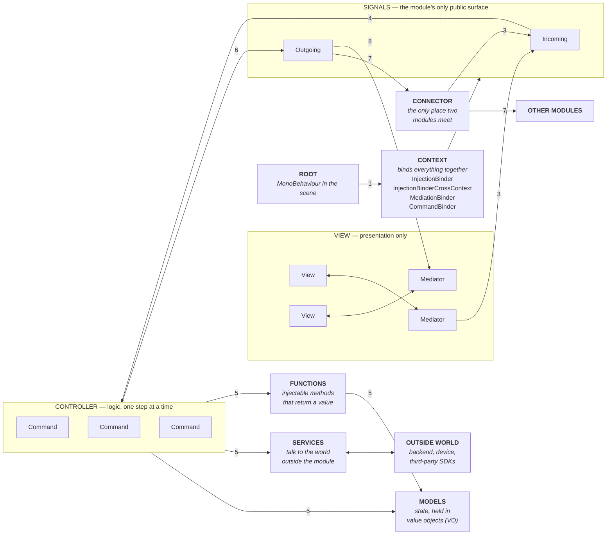
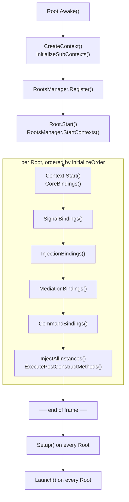

# FlowIoC

**A signal-driven IoC container and modular MVC framework for the Unity Engine.**

FlowIoC splits a game into self-contained **modules**. Each module owns its data
(Models), its logic (Commands and Functions), its presentation (Views and
Mediators), and a public **Signal** surface. Modules never reference each other's
internals — they are wired together declaratively by **Connectors**. The result is
a codebase where a feature can be added, tested in isolation, or deleted without
touching the rest of the game.

> FlowIoC is the successor to `mvc-base`. If you are migrating, note that the
> editor menus moved from `Tools/MVC/*` to `Tools/FlowIoC/*` and the command
> binding API changed from `.To<A>().To<B>().InSequence()` to
> `.ToSequence<A>().ToSequence<B>()`.

---

## FlowIoC at a Glance

One module, and how a click becomes a state change and comes back out as an event
another module can act on.



1. **Root** creates the Context and registers it with the `RootsManager`.
2. **Context** binds signals, models, mediations and commands, then every Root in
   the scene runs `Setup()` and `Launch()`.
3. A **Mediator** — or another module, through a **Connector** — dispatches an
   **Incoming** signal.
4. The **CommandBinder** runs the command chain bound to that signal, in sequence
   or in parallel.
5. **Commands** act on **Models** and **Services**, and call **Functions** when they
   need a value back.
6. A command dispatches an **Outgoing** signal to announce what happened.
7. A **Connector** carries that outgoing signal to another module's incoming
   signals. The two modules never reference each other.
8. **Mediators** listen to signals and drive their **Views**.

### Who does what

| | Responsible for | Must not |
|---|---|---|
| **Root** | Being the module's presence in the scene. Owns the Context, sets `initializeOrder`, hosts sub-contexts. | Contain game logic. A Root is normally an empty class. |
| **Context** | Declaring bindings — and nothing else. One `Bind` line per signal, model, mediation and command. | Run logic. If a Context has an `if`, that decision belongs in a Command. |
| **Signal** | Naming an event in the module's vocabulary, typed. `Incoming` is what the module accepts, `Outgoing` is what it announces. | Carry behaviour. A signal is a name and a payload, never a method call in disguise. |
| **Command** | One unit of work triggered by a signal. Injects models and services, mutates state, dispatches outgoing signals. | Hold state between runs, touch another module's model, or return a value — use a Function for that. |
| **Function** | An injectable method you call directly and get an answer from: a calculation, a lookup, a raycast. | Mutate state that a Command should own, or replace a Command in a flow you want visible in the console. |
| **Model** | State, and the rules that keep that state valid. Injected wherever it is needed. May dispatch an outgoing signal to announce that a value it holds has changed. | Know about Views, Commands, or any other module. Subscribe to a signal — an incoming signal runs a Command, and the Command calls the Model. |
| **Service** | A self-contained unit of work that answers the input it is given — a countdown, a parser, a storage wrapper. Reusable in any project, and the one thing another module may reference directly: add its assembly, inject its interface. | Depend on anything outside itself, or wait on another module's signal. A Service more than one module needs gets its own module. |
| **System** | The game-specific work a module owns. May lean on other Systems and Services: waiting on a signal they raise, or working from data they share. | Appear in another module's assembly. Two Systems in separate modules meet through a Connector, never through a reference. |
| **View** | Scene references and raw input. Exposes fields and callbacks. | Contain logic, or reach for a model. A View that has an `if` about game rules is doing the Mediator's job. |
| **Mediator** | Driving one View: subscribes to signals in `OnRegister`, unsubscribes in `OnRemove`, and turns view callbacks into outgoing signals. | Do the work itself. A Mediator dispatches; a Command decides. |
| **Connector** | Wiring one module's `Outgoing` signals to another's `Incoming` signals, in one readable place. | Transform game state. A converter that reshapes a payload is fine; a rule is not. |

---

## Table of Contents

- [FlowIoC at a Glance](#flowioc-at-a-glance)
- [Requirements](#requirements)
- [Installation](#installation)
- [Core Concepts](#core-concepts)
- [Application Lifecycle](#application-lifecycle)
- [Quick Start](#quick-start)
- [Signals](#signals)
- [Commands](#commands)
- [Injection](#injection)
- [Views and Mediators](#views-and-mediators)
- [Connectors](#connectors)
- [Functions](#functions)
- [Bundled Modules](#bundled-modules)
- [Editor Tools](#editor-tools)
- [AI Agent Rules](#ai-agent-rules)
- [Module Layout Convention](#module-layout-convention)
- [Samples](#samples)
- [Documentation Index](#documentation-index)
- [License](#license)

---

## Requirements

| | |
|---|---|
| Package name | `com.flowarc.flowioc.core` |
| Minimum Unity | `6000.0` (declared in `package.json`) |
| Actively developed against | Unity 6 (`6000.3`) |
| Dependencies | `com.unity.addressables` 2.9.1+, `com.unity.render-pipelines.core` 17.0.0+ (resolved automatically) |
| Assemblies | `FlowIoC` (runtime), `FlowIoC.Editor` (editor) |

---

## Installation

### As a UPM package (recommended)

In the editor: **Window → Package Manager → + → Install package from git URL**, then enter:

```
https://github.com/FlowArc/FlowIoC.git#1.1.1
```

Or add it to `Packages/manifest.json` directly:

```json
{
  "dependencies": {
    "com.flowarc.flowioc.core": "https://github.com/FlowArc/FlowIoC.git#1.1.1"
  }
}
```

Always pin a tag. Without `#<tag>` Unity resolves the tip of `master` and then locks that
commit into `packages-lock.json`, so the package silently stops tracking new releases.
To upgrade, change the tag and let Unity re-resolve.

> **Upgrading from `com.flowioc.core`?** The package was renamed in 1.1.0. Do it with the
> Editor closed and delete `Library/` before reopening — see the migration note in
> [`CHANGELOG.md`](CHANGELOG.md).

### As a git submodule (for working on FlowIoC itself)

```bash
git submodule add https://github.com/FlowArc/FlowIoC.git Packages/FlowIoC
git submodule update --init
```

Any folder under `Packages/` containing a `package.json` is treated by Unity as an *embedded*
package: it is writable, so you can edit and commit the framework straight from the consuming
project, and it takes precedence over any registry or Git version of `com.flowarc.flowioc.core`.

Anyone cloning a project that uses the submodule must run `git submodule update --init`,
otherwise `Packages/FlowIoC` stays empty and the project will not compile.

---

## Core Concepts

| Concept | Base type | Responsibility |
|---|---|---|
| **Root** | `Root<TContext>`, `SingletonRoot<TContext>` | The `MonoBehaviour` that lives in the scene and owns a Context. Drives the whole lifecycle. |
| **Context** | `Context` | Declares every binding of a module: signals, injections, mediations, commands. |
| **Signal** | `Signal`, `Signal<T1..T4>` | A typed event. The only thing a module exposes to the outside world. |
| **Command** | `Command`, `Command<T1..T4>` | A unit of logic triggered by a Signal. Sequential or parallel, retainable. |
| **Function** | `FunctionReturn<…>`, `FunctionVoid<…>`, `AsyncFunction` | An injectable method you call directly, with a return value if you need one. |
| **Model** | any class, usually `IXModel` / `XModel` | State. Injected wherever it is needed. |
| **View / Mediator** | `IView` + `ViewInjector`, `IMediator` | A `MonoBehaviour` in the scene and the injected class that drives it. |
| **Connector** | `SignalConnector` | Wires one module's outgoing Signals to another module's incoming Signals. |

The two binders you will use constantly:

| Binder | Scope | Use for |
|---|---|---|
| `InjectionBinder` | This Context only | Internal models, internal signals |
| `InjectionBinderCrossContext` | The whole application | Public signals, shared models and services |

---

## Application Lifecycle

A Root drives its Context through a fixed order. Sub-contexts run through the same
binding phases immediately after their parent.



The barrier matters: `Setup()` does not run until **every** Root in the scene has
finished binding, and `Launch()` does not run until every Root has finished
`Setup()`. So `Setup()` is the only safe place to reach across modules — which is
exactly what Connector contexts do — and `Launch()` is where you dispatch the first
signal.

Roots are ordered among themselves by the `initializeOrder` field exposed in the
inspector. Each phase can also be toggled off per-Root (`AutoInitialize`,
`AutoBindInjections`, `AutoBindMediations`, `AutoSetup`, `AutoLaunch`) so a context
can be driven manually in a test scene.

`SingletonRoot<TContext>` additionally reparents itself to the scene root, calls
`DontDestroyOnLoad`, and destroys duplicates — use it for application-wide modules
such as audio, analytics, or player profile.

---

## Quick Start

We will build a small `PlayerModule` that holds currency and reacts to a signal.

### 1. Generate the module

> **Tools ▸ FlowIoC ▸ Create Module**

The generator lays out the folder structure, writes the assembly definition, and
creates the `Root` / `Context` pair. The rest of this section shows what goes
inside.

### 2. Declare the signals

Split the surface into what the module *listens to* and what it *announces*.
Everything the outside world touches goes here; nothing else is public.

```csharp
using FlowIoC.BaseModule.Signals;

namespace Modules.PlayerModule.Signals
{
    public class PlayerSignals : ISignalHolder
    {
        public PlayerSignalsIncoming Incoming = new();
        public PlayerSignalsOutgoing Outgoing = new();
    }

    public class PlayerSignalsIncoming
    {
        public Signal InitializePlayer = new();
        public Signal<double> AddCurrency = new();
    }

    public class PlayerSignalsOutgoing
    {
        public Signal<double> CurrencyChanged = new();
    }
}
```

### 3. Write the model

```csharp
namespace Modules.PlayerModule.Models
{
    public interface IPlayerModel
    {
        double Currency { get; }
        void AddCurrency(double amount);
    }

    public class PlayerModel : IPlayerModel
    {
        public double Currency { get; private set; }

        public void AddCurrency(double amount) => Currency += amount;
    }
}
```

### 4. Write a command

Note that FlowIoC injects **properties**, not fields. `[Inject]`, `[InjectSignal]`
and `[SignalParam]` all target properties — a plain field is silently skipped.

```csharp
using FlowIoC.BaseModule.Controller;
using FlowIoC.BaseModule.Injectable.Attributes;
using Modules.PlayerModule.Models;
using Modules.PlayerModule.Signals;

namespace Modules.PlayerModule.Controllers
{
    public class AddCurrencyCommand : Command
    {
        [Inject]       private IPlayerModel  _playerModel { get; set; }
        [InjectSignal] private PlayerSignals _signals     { get; set; }

        [SignalParam]  private double _amount { get; set; }

        public override void Execute()
        {
            _playerModel.AddCurrency(_amount);
            _signals.Outgoing.CurrencyChanged.Dispatch(_playerModel.Currency);
        }
    }
}
```

### 5. Bind everything in the Context

```csharp
using FlowIoC.BaseModule.Contexts;
using Modules.PlayerModule.Controllers;
using Modules.PlayerModule.Models;
using Modules.PlayerModule.Signals;

namespace Modules.PlayerModule.RootsContexts
{
    public class PlayerContext : Context
    {
        private PlayerSignals _signals;

        public override void SignalBindings()
        {
            base.SignalBindings();

            // Cross-context: other modules may connect to these signals.
            _signals = InjectionBinderCrossContext.Bind<PlayerSignals>();
        }

        public override void InjectionBindings()
        {
            base.InjectionBindings();

            InjectionBinderCrossContext.Bind<IPlayerModel, PlayerModel>();
        }

        public override void CommandBindings()
        {
            base.CommandBindings();

            CommandBinder.Bind(_signals.Incoming.InitializePlayer)
                .ToSequence<InitializePlayerCommand>();

            CommandBinder.Bind(_signals.Incoming.AddCurrency)
                .ToSequence<AddCurrencyCommand>()
                .ToSequence<SavePlayerCommand>();
        }

        public override void Launch()
        {
            base.Launch();
            _signals.Incoming.InitializePlayer.Dispatch();
        }
    }
}
```

### 6. Add the Root to the scene

```csharp
using FlowIoC.BaseModule.Root;

namespace Modules.PlayerModule.RootsContexts
{
    public class PlayerRoot : SingletonRoot<PlayerContext> { }
}
```

Drop `PlayerRoot` on a GameObject in your bootstrap scene. That is the whole
module — dispatching `_signals.Incoming.AddCurrency.Dispatch(100d)` from anywhere
now runs both commands in order.

---

## Signals

Signals come in five arities: `Signal`, `Signal<T1>`, `Signal<T1, T2>`,
`Signal<T1, T2, T3>`, `Signal<T1, T2, T3, T4>`.

```csharp
public Signal InitializePlayer = new();
public Signal<double> AddCurrency = new();
public Signal<string, int> SelectHero = new();
```

Every signal supports direct listeners as well as command bindings:

```csharp
_signals.Incoming.AddCurrency.AddListener(OnCurrencyAdded);
_signals.Incoming.AddCurrency.AddListenerOnce(OnFirstCurrencyOnly);
_signals.Incoming.AddCurrency.RemoveListener(OnCurrencyAdded);

_signals.Incoming.AddCurrency.Dispatch(100d);
```

Grouping signals in an `ISignalHolder` with `Incoming` / `Outgoing` nested classes
is a convention, not a framework requirement — but it is what makes Connectors
readable, so it is strongly recommended. Signals that must never leave the module
belong in a separate `…SignalsInternal` holder bound with the plain
`InjectionBinder`.

Every dispatch is logged to the Flow Console unless the signal was constructed
with `hideCommandLog: true`.

---

## Commands

A command is bound to a signal and executed when that signal is dispatched.

### Sequence and parallel

```csharp
CommandBinder.Bind(_signals.Incoming.AddCurrency)
    .ToSequence<AddCurrencyCommand>()
    .ToSequence<SavePlayerCommand>();

CommandBinder.Bind(_signals.Incoming.Refresh)
    .ToParallel<RefreshInventoryCommand>()
    .ToParallel<RefreshProfileCommand>();
```

`ToSequence` steps wait for the previous step; `ToParallel` steps all start at
once. The two can be mixed in a single binding.

### Retain and Release

A command that finishes asynchronously must hold the sequence open:

```csharp
public class ACommand : Command
{
    [Inject] public ICoroutineProvider _coroutineProvider { get; set; }

    public override void Execute()
    {
        Retain();
        _coroutineProvider.StartCoroutine(DelayedComplete());
    }

    private IEnumerator DelayedComplete()
    {
        yield return new WaitForSeconds(3f);
        Release();
    }
}
```

`Release(params object[])` may pass data forward — the next command in the
sequence receives it through its typed `Execute` overload:

```csharp
public class SavePlayerCommand : Command<IPlayerModel>
{
    public override void Execute(IPlayerModel playerModel) => playerModel.Save();
}
```

`Stop()` aborts the rest of the sequence.

### Reading signal parameters

Each `[SignalParam]` property is filled from the payload of the signal that
triggered the command.

```csharp
public Signal<CurrencyType, int> DecreaseCurrency = new();
```

```csharp
[SignalParam] private CurrencyType _type   { get; set; }
[SignalParam] private int          _amount { get; set; }
```

When a signal carries more than one value of the same type, write the index of the
one you want. The index counts within that property's type, so inserting a
parameter of some other type into the signal does not shift it.

```csharp
public Signal<string, int, int> Damage = new();   // Dispatch("sword", 12, 3)
```

```csharp
[SignalParam]    private string _weapon { get; set; }   // "sword"
[SignalParam(0)] private int    _amount { get; set; }   // 12
[SignalParam(1)] private int    _crit   { get; set; }   // 3
```

A property with no index takes the first value of its type that no other property
has claimed, so two same-typed properties also resolve correctly on their own:

```csharp
public Signal<int, int> Move = new();   // Dispatch(3, 7)
```

```csharp
[SignalParam] private int _x { get; set; }   // 3
[SignalParam] private int _y { get; set; }   // 7
```

### Command groups

`ToGroupAsSequence` / `ToGroupAsParallel` splice another signal's entire command
chain into the current one, so shared sub-flows are declared once:

```csharp
CommandBinder.Bind(_signals.Incoming.StartGroupTest)
    .ToSequence<ACommand>()
    .ToGroupAsSequence(_internalSignals.TriggerGroupA)
    .ToSequence<BCommand>();

CommandBinder.Bind(_internalSignals.TriggerGroupA)
    .ToSequence<GroupCommandA>();
```

Constructor-style parameters can be passed at bind time:

```csharp
CommandBinder.Bind(_signals.Incoming.StartJumpTest)
    .ToSequence<GCommand>(true, _internalSignals.TriggerGroupA,
                                _internalSignals.TriggerGroupB);
```

See [`Controller.md`](Runtime/BaseModule/Controller/Documentation/Controller.md)
for the full execution model.

---

## Injection

```csharp
// Bind a concrete type; the instance is created and returned.
_model = InjectionBinder.Bind<PlayerModel>();

// Bind an interface to an implementation.
InjectionBinder.Bind<IPlayerModel, PlayerModel>();

// Bind an existing object.
InjectionBinder.BindInstance<IClock>(new ServerClock());

// Bind a MonoBehaviour, created on the context GameObject.
InjectionBinderCrossContext.BindMonoBehaviorInstance<IInputProvider, InputProvider>();

// Named bindings, when one interface has several implementations.
InjectionBinder.Bind<IStorage, RemoteStorage>("remote");
```

Retrieve with `[Inject]` (or `[Inject("remote")]`) on a property, or imperatively
via `InjectionBinder.GetInstance<T>()`.

`InjectionBinderCrossContext` is shared by every context in the application — bind
there when another module has to see the object, and to `InjectionBinder` when it
must not.

Two providers are always available without binding anything:

```csharp
[Inject] private ICoroutineProvider _coroutineProvider { get; set; }
[Inject] private IUpdateProvider    _updateProvider    { get; set; }

_updateProvider.AddUpdate(Tick);        // also AddLateUpdate / AddFixedUpdate
```

---

## Views and Mediators

A View is the `MonoBehaviour` in the scene; it holds references and raises
callbacks, and contains no logic. A Mediator is a plain injected class that drives
it.

> **Tools ▸ FlowIoC ▸ Create View** generates both and places them in the right
> module folder.

```csharp
[RequireComponent(typeof(ViewInjector))]
public class ConnectionFailView : MonoBehaviour, IView
{
    public bool IsRegistered { get; set; }

    public Action RetryConnection { get; set; }
    public Button RetryButton;

    private void Start() => RetryButton.onClick.AddListener(() => RetryConnection?.Invoke());
}
```

```csharp
public class ConnectionFailMediator : IMediator
{
    [Inject]       private ConnectionFailView _view    { get; set; }
    [InjectSignal] private ConnectionSignals  _signals { get; set; }

    public void OnRegister()
    {
        _view.RetryConnection += Retry;
    }

    public void OnRemove()
    {
        _view.RetryConnection -= Retry;
    }

    private void Retry() => _signals.Outgoing.RetryConnection.Dispatch();
}
```

Bind the pair in the context:

```csharp
public override void MediationBindings()
{
    base.MediationBindings();

    MediationBinder.Bind<ConnectionFailView>().To<ConnectionFailMediator>();
}
```

The `ViewInjector` component lists every `IView` on the GameObject and resolves
which Context each one belongs to — by bubbling up the hierarchy, by an explicit
Root selection, or by Root name. Registration happens as soon as that Context is
started, and `OnRemove` runs when the object is destroyed.

Clear **Auto Register** for a view in the ViewInjector list to take over yourself:

```csharp
using FlowIoC.BaseModule.ViewsMediators.Utils;

_view.Register();
_view.UnRegister();
```

---

## Connectors

Connectors are what keep modules independent. A module dispatches its `Outgoing`
signals without knowing who listens; a Connector context binds those to other
modules' `Incoming` signals.

```csharp
using FlowIoC.BaseModule.Connectors;
using FlowIoC.BaseModule.Contexts;

public class HeroConnectorSubContext : Context
{
    private HeroSignals                _heroSignals;
    private PlayerProfileSignals       _playerProfileSignals;
    private HeroSelectionScreenSignals _heroSelectionScreenSignals;

    public override void Setup()
    {
        Bindings();
        IncomingSignals();
        OutGoingSignals();
    }

    private void Bindings()
    {
        _heroSignals                = InjectionBinderCrossContext.Bind<HeroSignals>();
        _playerProfileSignals       = InjectionBinderCrossContext.Bind<PlayerProfileSignals>();
        _heroSelectionScreenSignals = InjectionBinderCrossContext.Bind<HeroSelectionScreenSignals>();
    }

    private void IncomingSignals()
    {
        _heroSelectionScreenSignals.Outgoing.PurchaseHero.Connect(_heroSignals.Incoming.PurchaseHero);
        _heroSelectionScreenSignals.Outgoing.SelectHero.Connect(_heroSignals.Incoming.SelectHero);
    }

    private void OutGoingSignals()
    {
        _heroSignals.Outgoing.DecreaseCurrency.Connect(_playerProfileSignals.Incoming.DecreaseCurrency);
    }
}
```

`Connect` also accepts a plain delegate, and can adapt between signals whose
parameter types differ:

```csharp
// Signal -> Action
_heroSignals.Outgoing.CurrencySpent.Connect(vo => Analytics.Log(vo));

// Signal<A> -> Signal<B> through a converter
_matchSignals.Outgoing.MatchEnded.Connect(_analyticsSignals.Incoming.LogEvent,
                                          summary => summary.ToAnalyticsEvent());
```

Every connection can carry a `groupId` so it can be torn down as a unit:

```csharp
private const string Group = nameof(HeroConnectorSubContext);

_heroSignals.Outgoing.DecreaseCurrency
    .Connect(_playerProfileSignals.Incoming.DecreaseCurrency, Group);

// ...
SignalConnector.DisconnectGroup(Group);
```

Connections registered without a group are removed with `signal.Disconnect()`.
`SignalConnector.DisconnectAll()` clears everything and runs automatically on
subsystem registration, so connections never leak between play sessions.

> **In production:** *HitNPoP* keeps a dedicated `ConnectorModule` whose root owns
> fifteen sub-contexts — one per domain (`HeroConnectorSubContext`,
> `MatchConnectorSubContext`, `ScreenConnectorSubContext`, …). Every cross-module
> edge in the game lives in that one module, so the wiring can be read top to
> bottom in a single folder.

---

## Functions

Functions are injectable methods. Unlike commands they return values and are called
directly instead of being dispatched.

```csharp
public class CalculateDamageFunction : FunctionReturn<double, string>
{
    [Inject] private IPlayerModel  _playerModel  { get; set; }
    [Inject] private IWeaponsModel _weaponsModel { get; set; }

    public override double Execute(string weaponId)
    {
        var config = _weaponsModel.GetConfigVO(weaponId);
        return config.baseDamage * _playerModel.GetDamageMultiplier();
    }
}
```

```csharp
[Inject] private IFunctionProvider _functionProvider { get; set; }

var damage = _functionProvider
    .Execute<CalculateDamageFunction>()
    .AddParams(weaponId)
    .SetReturn<double>();

_functionProvider.Execute<RefreshHudFunction>().SetVoid();
```

| Base type | Terminator | Shape |
|---|---|---|
| `FunctionReturn<TReturn>`, `FunctionReturn<TReturn, T1..T4>` | `.SetReturn<TReturn>()` | returns a value |
| `FunctionVoid`, `FunctionVoid<T1..T4>` | `.SetVoid()` | returns nothing |
| `AsyncFunction`, `AsyncFunction<T1>` | `.SetAsync()` | runs on a coroutine, reports back through `AddFunctionCompletedCallback` |

```csharp
_functionProvider
    .ExecuteAsync<LoadProfileFunction>()
    .AddFunctionCompletedCallback(OnProfileLoaded)
    .SetAsync();
```

---

## Bundled Modules

| Module | Entry point | What it does |
|---|---|---|
| **ScreenModule** | `IScreenService.Open<TScreen>().Show()` | UI screens and popups: layers, pooling, addressable loading, opening and closing animations. → [docs](Runtime/ScreenModule/Documentation/ScreenModule.md) |
| **PoolModule** | `IPoolService.Get<T>(key, parent)` | Config-driven object pooling with groups and prewarming. → [docs](Runtime/PoolModule/Documentation/PoolModule.md) |
| **AssetModule** | `IAssetService.LoadAssetAsync<T>(key, groupId)` | Load-once Addressables layer with group-scoped release. → [docs](Runtime/AssetModule/Documentation/AssetModule.md) |
| **ConsoleModule** | `FlowLogger.Log(FlowLogType.PlayerModule, …)` | A filterable in-editor console, wired into the framework itself. → [docs](Runtime/ConsoleModule/Documentation/FlowConsole.md) |

The framework logs its own activity on the built-in channels `Context`,
`Injection`, `Signal`, `Command`, `CommandOperation`, `Function`, `Screen`, `Pool`,
`Model` and `Asset`, each of which can be toggled in the Flow Console window — so
you can watch every signal dispatch and command step without adding a single log
line.

For your own logs, Flow Console auto-registers one channel per module and
regenerates `Assets/Plugins/FlowIoC/Generated/FlowLogType.cs` with a constant for each:

```csharp
using FlowIoC.ConsoleModule;

FlowLogger.Log(FlowLogType.PlayerModule, $"{nameof(Execute)} - {nameof(AddCurrencyCommand)}");
FlowLogger.LogError(FlowLogType.PlayerModule, "Currency went negative.");
```

Logging is compiled out unless the `ENABLE_LOG` scripting define is set.

---

## Editor Tools

| Menu | Purpose |
|---|---|
| `Tools/FlowIoC/Create Module` | Scaffold a module: folders, assembly definition, Root and Context |
| `Tools/FlowIoC/Create Command` | Generate a command |
| `Tools/FlowIoC/Create Model` | Generate an `IXModel` / `XModel` pair |
| `Tools/FlowIoC/Create View` | Generate a View, a Mediator, and the prefab |
| `Tools/FlowIoC/Delete Module` | Remove a module and its references |
| `Tools/FlowIoC/Console/Flow Console` | The filterable runtime log window |
| `Tools/FlowIoC/Model Viewer` | Inspect live model state at runtime |
| `Tools/FlowIoC/Folder Drawer` | Colour Project window folders by path or by folder |
| `Tools/FlowIoC/Screen Config Manager` | Edit the screen catalogue |
| `Tools/FlowIoC/Assembly Creator Window` | Create assembly definitions |
| `Tools/FlowIoC/Module Configuration/…` | Detect, fix, and cleanse module metadata; update namespace settings and the solution code style |
| `Tools/FlowIoC/AI/Agent Rules` | Write FlowIoC's architecture rules into the project's `AGENTS.md` |
| `Tools/FlowIoC/Help` | An introduction to the architecture, one topic at a time, inside the Editor |
| `Assets/FlowIoC/Create Assembly` | Assembly definition for the selected folder |
| `Assets/FlowIoC/Update Module's Namespaces` | Rewrite namespaces after a move or rename |

`Update Namespace Settings` also writes `<Solution>.sln.DotSettings`, the ReSharper and Rider
code style FlowIoC ships: naming rules, the `_` prefix on private members, the `VO` suffix
family, spacing. Rider only reads a settings file named after the solution, which differs per
project, so the file is generated rather than shipped. Only the keys FlowIoC owns are written -
anything else in the file survives - and the result belongs in version control, unlike the
`.sln.DotSettings.user` file beside it.

Attributes that affect the editor: `[CustomClassHeader]` colors a Root or Context
header, `[ShowInModelViewer]` / `[HideInModelViewer]` control Model Viewer output,
`[ExcludeFromContextWindow]` hides a context from the sub-context picker, and
`[ReadOnly]` locks an inspector field.

See [`Editor/README.md`](Editor/README.md) and
[`CodeGenerator/Documentation.md`](Editor/CodeGenerator/Documentation.md).

---

## AI Agent Rules

FlowIoC imposes an architecture that nothing in the C# type system enforces, so an
AI coding assistant that has not been told the rules will happily write code that
compiles and violates every one of them — logic in a Context, one module injecting
another's model, `[Inject]` on a field where it is silently skipped.

> **Tools ▸ FlowIoC ▸ AI ▸ Agent Rules**

The window writes those rules into your project's root `AGENTS.md` — the convention
Claude Code, Codex, Cursor, Zed and Gemini CLI all read — and points `CLAUDE.md` at
that file. The rules land inside a marked block:

```
<!-- FLOWIOC:BEGIN version=<installed> hash=<rule text> | ... -->
...
<!-- FLOWIOC:END -->
```

Nothing outside the markers is ever touched, so rules you wrote yourself are safe,
and a malformed marker makes the tool refuse to write rather than guess. FlowIoC
offers to install the block the first time you open a project and to refresh it when
the rules change; the offer is remembered, so declining it is permanent until the
rules themselves change. Removing FlowIoC through the Package Manager removes the
block with it.

The rule text ships in `Documentation~/AgentRules.md`.

---

## Module Layout Convention

`Create Module` produces this shape. Keeping it makes the generators and the
namespace tools work without configuration:

```
Modules/
└── PlayerModule/
    ├── Modules.Player.asmdef
    ├── Prefabs/
    ├── Resources/
    ├── Scenes/
    ├── Scripts/
    │   ├── Editor/
    │   └── Runtime/
    │       ├── Constants/         # constant strings and keys
    │       ├── Controllers/       # commands
    │       ├── Datas/
    │       │   ├── UnityObjects/  # ScriptableObject configs
    │       │   └── ValueObjects/  # plain data (…VO)
    │       ├── Entities/          # MonoBehaviours owned by the module
    │       ├── Enums/
    │       ├── Functions/
    │       ├── Models/
    │       ├── RootsContexts/     # PlayerRoot, PlayerContext, sub-contexts
    │       ├── Services/          # self-contained, reusable in any project
    │       ├── Signals/           # PlayerSignals, PlayerSignalsInternal
    │       ├── Systems/           # this game's own logic
    │       ├── ScreenViews/
    │       └── ViewsMediators/
    ├── zScreenModules/
    ├── zSubModules/
    └── zTestModules/
```

The generator creates the module folder, the assembly definition, the managed
folders (`Controllers`, `Models`, `RootsContexts`, `Services`, `Systems`,
`ViewsMediators`, `ScreenViews`, `UnityObjects`, `ValueObjects`, `ScreenConfigs`,
`Editor`, `Resources`, `Prefabs`, `Scenes`, and the three `z` folders) and —
optionally — the `Root` / `Context` pair. Their names are not hard-coded; they come
from the module config and can be renamed under
*Tools ▸ FlowIoC ▸ Module Configuration*. `Constants`, `Datas`, `Entities`, `Enums`,
`Functions` and `Signals` are team convention rather than generator output — add
them as the module needs them.

> **`Systems` in a project that predates it.** The folder list lives in
> `Assets/Plugins/FlowIoC/Editor/CodeGenerator/MainModuleDirectoryStructureConfig.asset`, which
> is written once, in your project. Upgrading FlowIoC does not rewrite it, so a project
> created before `Systems` existed keeps its old list and the generator will not produce
> the folder. Add it in that asset's inspector, or delete the asset and let FlowIoC
> recreate it — deleting also discards any folder renames you made.

The three `z`-prefixed folders sort to the bottom and each holds a nested module
with its own Context:

- **`zSubModules/`** — a feature that belongs to this module but is large enough to
  deserve its own Context, attached to the parent Root as a sub-context.
- **`zScreenModules/`** — one folder per UI screen, so a screen's signals, commands
  and views travel together.
- **`zTestModules/`** — an isolated test scene and context, marked `IsTest` so it
  never starts in a real build.

A nested module may use the types of the module it sits in — a screen module reaching
its parent's System, for instance. The direction is one way: a module never knows what
its own `z` folders contain, so the parent's assembly never references theirs.

`zTestModules` is exempt from all of it. Everything there is test code, so it may
reference any module in the project; in exchange, every script in it is wrapped in
`#if UNITY_EDITOR` and never reaches a build.

Sub-contexts are attached from the Root's inspector (*Add Sub Context*), which
lists every `Context` type in the project. Mark a context with
`[ExcludeFromContextWindow]` to keep it out of that list.

---

## Samples

Import **Command Execution Test Module** from the package's Samples tab. It is a
runnable reference for sequence, parallel, retain/release, and command-group
execution, and logs each step so the order is visible in the console.

---

## Documentation Index

One document per subsystem. Each is written the same way: what the piece is for, how
to use it, worked good-versus-bad scenarios, and the pitfalls that bite in practice.

| Area | Document |
|---|---|
| Roots, contexts, injection, signals, mediation | [Base Module](Runtime/BaseModule/Documentation/BaseModule.md) |
| Writing and chaining logic | [Commands](Runtime/BaseModule/Controller/Documentation/Controller.md) |
| UI screens and popups | [Screens](Runtime/ScreenModule/Documentation/ScreenModule.md) |
| Object pooling | [Pooling](Runtime/PoolModule/Documentation/PoolModule.md) |
| Addressables and asset groups | [Assets](Runtime/AssetModule/Documentation/AssetModule.md) |
| Runtime logging and diagnosis | [Flow Console](Runtime/ConsoleModule/Documentation/FlowConsole.md) |
| The FlowIoC editor menu | [Editor Tools](Editor/README.md) |
| Scaffolding modules and classes | [Code Generator](Editor/CodeGenerator/Documentation.md) |

---

## License

See [LICENSE](LICENSE.md).
